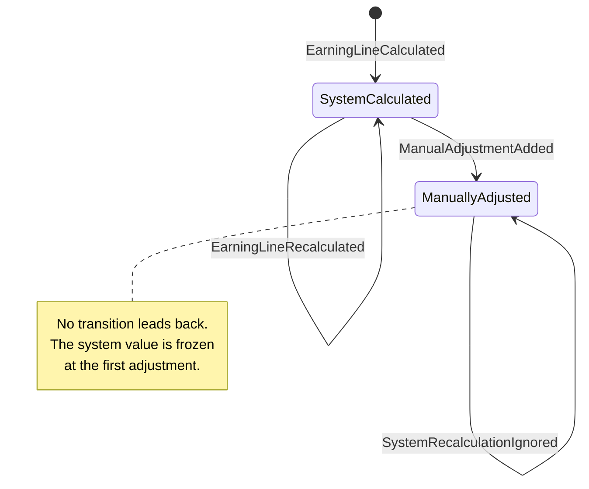

# Manual Adjustments to an Earning Line

An event-sourced domain model for a payroll earning line: the system
calculates it automatically, and a specialist may correct it with a signed
amount and a mandatory comment that can never be edited or deleted and
that, once applied, permanently stops the system from moving the line's
value. A library plus one CLI script (`bin/scenario.php`) — no framework,
no database, no UI.

## Layout

```
src/
  Domain/                  the rules. Depends on nothing but PHP.
    Shared/                concepts both the money and the line need:
                           Money, Currency, the DomainEvent contract
    EarningLine/           the aggregate and its vocabulary — EarningLine, plus
                           the value objects it refuses to exist without
                           (Comment, SpecialistId, AdjustmentNumber, ...)
      Event/               the four facts a line can record
      Exception/           the ways a caller can be told "no"
  Application/             use cases. Knows Domain, never Infrastructure.
    Command/               the three writes, each paired with its handler
    Port/                  what the application needs from the outside world
    Query/                 the audit read model and the one query that builds it
  Infrastructure/          adapters. Knows both layers above.
    Persistence/           the in-memory event store and the repository
    Clock/                 the only place that reads the wall clock
    Identity/              UUID generation — the domain never makes identity
    Cli/                   formatting and the audit table

bin/scenario.php           composition root: wires everything by hand, no container
tests/                     Unit / Integration / Acceptance / Architecture / Support
```

Three placements are deliberate rather than habitual:

- **`Exception/` sits next to whatever throws it.**
- **A command and its handler live together**, since they change together.
- **`Port/` is inside `Application`, not `Infrastructure`.**
  `GetEarningLineAuditHandler` needs the `EventStore` directly, to fold the
  event stream without loading the aggregate. `tests/Architecture` fails the
  build if `Domain` references `Application`/`Infrastructure`, or
  `Application` references `Infrastructure`.

## How to run

Requires PHP 8.5 and Composer.

```bash
composer install
composer check     # coding standards + PHPStan (level max) + PHPUnit
composer scenario  # prints the reference scenario step by step
```

Without a local PHP 8.5, build the image and run everything inside it:

```bash
docker build -t alcor . && docker run --rm alcor composer check
docker run --rm alcor composer scenario
```

Or use `docker-compose.yml`, which bind-mounts the working tree into a PHP
8.5 container. `composer install` must also run inside it — a host without
PHP 8.5 can't satisfy `composer.json`'s `"php": "^8.5"` to produce `vendor/`
itself:

```bash
docker compose run --rm php composer install
docker compose run --rm php composer check
docker compose run --rm php composer scenario
```

`composer scenario` runs the eight-step reference scenario end to end and
prints the audit table — real output; only the earning line id (a fresh
random UUID) varies between runs:

```
Earning line a3def6c7-5736-4a82-a60a-7d99ab3351fb

Step 1  System calculates the line                                                $1,000.00
Step 2  System recalculates (allowed, no correction yet)                          $1,050.00
Step 3  Adjustment #1  -$45.55                                                    $1,004.45
Step 4  System recalculates (ignored, line is frozen)                             $1,004.45
Step 5  Adjustment #2  +$100.10                                                   $1,104.55
Step 6  Adjustment #3  -$0.10                                                     $1,104.45
Step 7  Adjustment #4  -$0.20                                                     $1,104.25
Step 8  Adjustment #5  +$0.20  (compensates adjustment #4, made at step 7)        $1,104.45

Audit history

+-----------------------+-----------+-------------------------------------------------------+
| Entry                 | Value     | Comment                                               |
+-----------------------+-----------+-------------------------------------------------------+
| System value (frozen) | $1,050.00 | frozen at the first correction                        |
| Adjustment 1          | -$45.55   | Employee declined dental benefit; reversing deduction |
| Adjustment 2          | +$100.10  | Late correction: missed approved overtime bonus       |
| Adjustment 3          | -$0.10    | Minor rounding adjustment                             |
| Adjustment 4          | -$0.20    | Second minor rounding adjustment                      |
| Adjustment 5          | +$0.20    | Correcting mistake in adjustment #4 (compensates #4)  |
| Recalculation ignored | $1,075.00 | attempted by the system, refused by the freeze rule   |
| Current value         | $1,104.45 |                                                       |
+-----------------------+-----------+-------------------------------------------------------+
```

## Domain model

An `EarningLine` aggregate is reconstructed by folding its event stream.
State changes only by applying an event — `record()` calls the same
`apply()` that `reconstitute()` drives on replay, so a replay cannot
diverge from a live line. `AuditHistoryProjection` is a second, independent
fold over the same events, kept honest only by the acceptance test. The
first adjustment moves a line to `ManuallyAdjusted` permanently: later
same-currency recalculations are ignored; foreign-currency ones throw, in
either status.



There is no `Adjustment` class — comments, authors and timestamps live only
in events and the read model, making "never edited" structural. Adjustment
numbers run `1..lastAdjustmentNumber`. Commands carry primitives, not value
objects, since they are messages that would arrive serialized over a
transport; handlers build the value objects at the edge and return `void`.
The aggregate's `AdjustmentNumber` is never read by the CLI — only
observable through the audit query `AuditTableRenderer` prints.

## How each business rule is enforced

Every test name below was checked against
`docker compose run --rm php vendor/bin/phpunit --list-tests`.

| Rule | Class / method | Test |
|---|---|---|
| Recalculation in a different currency is always refused, in either status, and records nothing | `EarningLine::recalculate()` — currency compared first, before any status branch | `EarningLineTest::test_a_line_carries_one_currency_for_its_lifetime`, `EarningLineTest::test_a_refused_recalculation_records_nothing`, `EarningLineTest::test_a_frozen_line_still_refuses_a_foreign_currency` |
| Recalculation before any adjustment moves the value | `EarningLine::recalculate()` while `status === SystemCalculated` | `EarningLineTest::test_recalculation_is_allowed_while_no_one_has_corrected_the_line` |
| Recalculation to an unchanged value, before any adjustment, records nothing | `EarningLine::recalculate()` value comparison | `EarningLineTest::test_recalculating_to_the_same_value_records_nothing` |
| Recalculation after the first adjustment is permanently ignored, not applied and not an error | `EarningLine::recalculate()` while `status === ManuallyAdjusted` records `SystemRecalculationIgnored` | `EarningLineTest::test_recalculation_is_ignored_once_line_has_manual_adjustment`, `EarningLineTest::test_the_freeze_survives_any_number_of_later_recalculations`, `EarningLineTest::test_an_ignored_recalculation_is_recorded_even_when_the_value_would_not_change` |
| A correction requires a non-empty comment | `Comment` constructor | `CommentTest::test_an_adjustment_may_not_be_explained_by_nothing` (empty, spaces, tab-and-newline datasets) |
| A comment is at most 500 characters, a specialist id at most 100 — both counted in characters, not bytes | `Comment::MAX_LENGTH`, `SpecialistId::MAX_LENGTH` | `CommentTest::test_it_rejects_a_comment_one_character_too_long`, `CommentTest::test_length_is_counted_in_characters_not_bytes`, `SpecialistIdTest::test_it_rejects_an_identifier_one_character_too_long` |
| A zero-amount adjustment is refused | `EarningLine::addAdjustment()` | `EarningLineTest::test_an_adjustment_must_change_something` |
| A cross-currency adjustment is refused | `EarningLine::addAdjustment()` explicit currency check | `EarningLineTest::test_an_adjustment_must_be_in_the_lines_currency` |
| A correction cannot compensate an adjustment number that was never issued (including itself) | `EarningLine::addAdjustment()` bounds-checks against `lastAdjustmentNumber` | `EarningLineTest::test_a_correction_cannot_point_at_an_adjustment_that_does_not_exist`, `EarningLineTest::test_a_correction_cannot_point_at_the_adjustment_being_created` |
| A mistake is fixed by a new, linked adjustment, never by altering the one it corrects | `EarningLine::addAdjustment(..., ?AdjustmentNumber $compensates)` — compensation is a link, no mutation of the earlier event | `EarningLineTest::test_a_mistake_is_fixed_by_a_new_adjustment_that_points_at_it`, `EarningLineTest::test_compensation_is_a_link_not_an_enforced_opposite_amount` |
| A line freezes permanently on its first adjustment; no code path leads back | `EarningLine::applyAdjustmentAdded()` flips `LineStatus` to `ManuallyAdjusted` on `ManualAdjustmentAdded`; no method reverses it | `EarningLineTest::test_the_freeze_survives_any_number_of_later_recalculations` |
| Calculating a line that already exists is refused as a duplicate, distinct from a genuine concurrency race | `CalculateEarningLineHandler` checks `EarningLineRepository::exists()` before appending | `CalculateEarningLineHandlerTest::test_calculating_the_same_line_twice_is_refused_as_a_duplicate` |
| The current value is available at any time without replaying by hand | `EarningLine::currentValue()`, `AuditHistoryView::$currentValue` | `EarningLineTest::test_an_adjustment_moves_the_current_value_by_its_signed_amount`, `AuditHistoryProjectionTest::test_it_reports_every_correction_in_the_order_they_were_made` |
| The full audit history is available at any time, including ignored recalculations, kept apart from the adjustment list | `AuditHistoryProjection`, `AuditHistoryView` | `AuditHistoryProjectionTest::test_nothing_is_frozen_before_the_first_correction`, `AuditHistoryProjectionTest::test_the_first_correction_freezes_the_system_value`, `AuditHistoryProjectionTest::test_ignored_recalculations_are_not_part_of_the_adjustment_history` |
| The whole scenario from the brief produces the expected numbers and the expected audit view, end to end | `bin/scenario.php`, the application layer as a whole | `ReferenceScenarioTest::test_the_reference_scenario_produces_the_expected_numbers`, `ReferenceScenarioTest::test_the_reference_scenario_produces_the_expected_audit_history` |

## Assumptions

1. Amounts are signed deltas. Money is stored in integer minor units. A line
   has one currency for its lifetime.
2. The step-3 comment says "reversing deduction" while the amount is negative.
   The amount is authoritative; the comment is free text.
3. A line must be system-calculated before it can be adjusted — `calculate()`
   is the only way to create a new line (`reconstitute()` is a second public
   factory, but it replays an existing stream rather than starting one).
4. Recalculation with an unchanged value records nothing.
5. Ignored recalculations are recorded so a recalculation the freeze
   suppressed stays visible, but they are not part of the adjustment history.
6. Compensation is a link, not an enforced equal-and-opposite amount.
7. A line value may become negative; no business rule forbids it.
8. Every adjustment records who made it and when.
9. Aggregate state is minimal by design; audit detail lives in the events and
   the read model.
10. `EarningLineId` is a client-generated RFC 4122 UUID supplied in the command;
    the domain never generates identity.
11. `SpecialistId` is an opaque identifier from an external identity context;
    no format is assumed.
12. Supported currencies are USD/EUR/GBP. Precision is asked of the currency so
    0- or 3-decimal currencies can be added later.
13. The brief gives no attempted value for the ignored recalculation at step 4 —
    only that the line's value must not move. The scenario and the acceptance
    test use `1075.00`, chosen to differ from the frozen `1050.00` so that the
    test would fail if the value were silently adopted.
14. The audit history reports the frozen system value, the corrections and the
    current value — not the accepted recalculations that preceded the first
    correction. This matches the expected audit history in the assignment
    brief exactly. Refused recalculations *are* reported, which is more than
    the brief asks for, because the difference between what the system would
    pay and what the specialist decided is worth seeing.
15. An earning line carries no employee, payroll period or earning-type
    reference. None of the six business rules needs one, and adding them
    would model a payroll system rather than the rule under test.

## Trade-offs and what I would do next

**Persistence.** Events live only in memory. A SQL-backed store would come
next, enforcing append-only at the database itself: a unique constraint on
`(stream_id, version)`, and an events table with no `UPDATE`/`DELETE`
privilege for the application's database role.

**Serialization is out of scope.** A future serializer must map value
objects to storable scalars without re-applying today's validation to
yesterday's data — an old comment must still load if a length limit later
changes.

**Left for later:** snapshots, once replay-per-read is a real cost;
payroll-period close and what happens to a line once its period closes;
notifications when a `SystemRecalculationIgnored` is recorded, visible
today only in the audit history; and idempotency keys, so a retried
`AddManualAdjustment` can't double-apply.

## How AI was used

Built with Claude Code end to end: a design document was written and
reviewed *before any code was written*
(`docs/superpowers/specs/2026-09-16-earning-line-adjustments-design.md`),
then a task-by-task plan (`docs/superpowers/plans/`), both committed
alongside the code. Each task was implemented test-first and reviewed by a
separate reviewer before the next began — two findings touch code a
reviewer will see here: the audit table's missing leading `+` on positive
corrections (`AuditTableRenderer`), and a compensation-link test that
asserted only the balance instead of the recorded `compensates` field.
`git log` is part of the answer: small, green commits, each explaining why.
