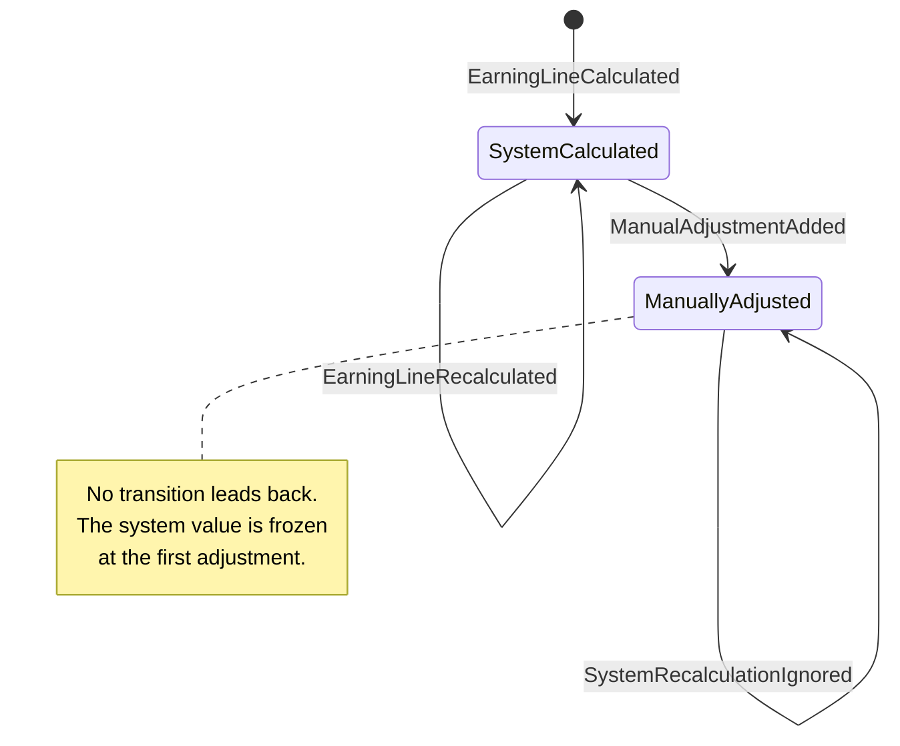

# Manual Adjustments to an Earning Line

Proof of concept for the Alcor OS payroll platform: an event-sourced domain model
for a payroll earning line that the system calculates automatically and that a
payroll specialist may correct manually, permanently and traceably.

## Table of contents

1. [What this is](#what-this-is)
2. [How to run](#how-to-run)
3. [Domain model](#domain-model)
4. [Why event sourcing](#why-event-sourcing)
5. [How each business rule is enforced](#how-each-business-rule-is-enforced)
6. [Assumptions](#assumptions)
7. [Trade-offs and what I would do next](#trade-offs-and-what-i-would-do-next)
8. [How AI was used](#how-ai-was-used)

## What this is

An event-sourced domain model for manual corrections to a payroll earning
line: the system calculates a line automatically, and a payroll specialist may
correct it with a signed amount and a mandatory comment, in a way that can
never be edited or deleted and that, once applied, permanently stops the
system from moving the line's value again. It is a library plus one CLI
script (`bin/scenario.php`) — no framework, no database, no UI.

## How to run

Requires PHP 8.5 and Composer.

```bash
composer install
composer check     # coding standards + PHPStan (level max) + PHPUnit
composer scenario  # prints the reference scenario step by step
```

Without a local PHP 8.5, build the image and run everything inside it — this
is the path a reviewer without PHP 8.5 should take:

```bash
docker build -t alcor . && docker run --rm alcor composer check
docker run --rm alcor composer scenario
```

During development, `docker-compose.yml` bind-mounts the working tree over a
`vendor/` installed once on the host, so the toolchain always runs against
PHP 8.5 regardless of what the host has:

```bash
docker compose run --rm php composer check
docker compose run --rm php composer scenario
```

`composer scenario` runs the eight-step reference scenario end to end through
the application layer and prints the resulting audit table. This is real
output from an actual run — the earning line id is a fresh random UUID every
time, everything else is deterministic:

```
Earning line 63eceb59-69ca-4fc7-aa4f-49d11f12f538

1. System calculates the line                                   $1,000.00
2. System recalculates (allowed, no correction yet)             $1,050.00
3. Adjustment -$45.55                                           $1,004.45
4. System recalculates (ignored, line is frozen)                $1,004.45
5. Adjustment +$100.10                                          $1,104.55
6. Adjustment -$0.10                                            $1,104.45
7. Adjustment -$0.20                                            $1,104.25
8. Adjustment +$0.20 (compensates #4)                           $1,104.45

Audit history

+-----------------------+-----------+-------------------------------------------------------+
| Entry                 | Value     | Comment                                               |
+-----------------------+-----------+-------------------------------------------------------+
| System value (frozen) | $1,050.00 | frozen at the first correction                        |
| Adjustment 1          | -$45.55   | Employee declined dental benefit; reversing deduction |
| Adjustment 2          | +$100.10  | Late correction: missed approved overtime bonus       |
| Adjustment 3          | -$0.10    | Minor rounding adjustment                             |
| Adjustment 4          | -$0.20    | Second minor rounding adjustment                      |
| Adjustment 5          | +$0.20    | Correcting mistake in adjustment #4 (compensates #4)  |
| Recalculation ignored | $1,075.00 | attempted by the system, refused by the freeze rule   |
| Current value         | $1,104.45 |                                                       |
+-----------------------+-----------+-------------------------------------------------------+
```

## Domain model

An `EarningLine` aggregate is reconstructed by folding its event stream.
Every state change is recorded as a past-tense domain event before it is
applied to in-memory state, so the write model, the read model and a fresh
replay can never disagree. Once a line has taken its first manual adjustment
it moves to `ManuallyAdjusted` and never leaves — every later recalculation
is recorded as an ignored attempt, not silently applied and not an error.



The aggregate keeps decision state only — id, currency, system value,
current value, status, the last issued adjustment number, and the stream
version. **There is no `Adjustment` class in the domain.** Comments,
authors and timestamps are facts about the past; they live in the events and
in the read model, never in a mutable in-memory object. This is what makes
"a correction can never be edited" structural rather than a convention: there
is no object holding a comment that any code path could reassign. Adjustment
numbers are sequential from 1, so the set of numbers ever issued is exactly
`1..lastAdjustmentNumber` — nothing else needs to be stored to validate that
a compensation target exists.

The write side (`EarningLine` and its handlers) and the read side
(`AuditHistoryProjection` → `AuditHistoryView`) are separate: the audit query
loads the raw event stream from the `EventStore` and folds it directly,
without ever constructing the aggregate. This is also why the `EventStore`
port lives in `Application/Port/` rather than `Infrastructure/Persistence/`
as the original instruction file specified: the read side needs the store
directly, and a port sitting in `Infrastructure` would have forced
`Application` to depend on `Infrastructure`, breaking the inward-only
dependency rule at the very first query handler.

Commands (`CalculateEarningLine`, `RecalculateEarningLine`,
`AddManualAdjustment`) carry primitives — strings and an optional int — not
value objects, because a command is a message that would arrive serialized
over a transport in a real system; handlers build the value objects, so
invalid input is rejected by the domain itself, at the edge of the
application. Handlers return `void` (command-query separation); the
aggregate still returns the assigned `AdjustmentNumber` internally, and the
CLI recovers adjustment numbers by reading them back through the audit
query rather than through a command's return value.

## Why event sourcing

The requirement "no correction may ever be edited or deleted" is the
definition of an append-only event stream. Modelling it as one makes the rule
structural rather than declarative: there is no code path that could mutate a
past correction, because past corrections are not stored as mutable rows.

The permanent freeze on recalculation is the second reason. A CRUD model
would store a `system_value` column that recalculation overwrites, and the
freeze would depend on remembering to check a flag at every write site. As an
event stream, the frozen value is simply the latest system value in effect
when the first `ManualAdjustmentAdded` is recorded, carried forward by
whichever of `EarningLineCalculated` or `EarningLineRecalculated` came last —
so a line adjusted without ever being recalculated freezes at its originally
calculated value. Later recalculations are recorded as
`SystemRecalculationIgnored` and change nothing.

A plain OO model — a mutable `EarningLine` row plus an append-only
`adjustments` table and a boolean "frozen" flag — would also be a valid
answer to this brief, and would be simpler to build. The trade-off: event
sourcing costs a projection and a store on top of the domain model; it buys
an audit trail that cannot be forged, because forging it would require
rewriting history rather than flipping a column.

## How each business rule is enforced

Every test name below was checked against
`docker compose run --rm php vendor/bin/phpunit --list-tests`.

| Rule | Class / method | Test |
|---|---|---|
| Recalculation in a different currency is always refused, in either status, and records nothing | `EarningLine::recalculate()` — currency compared first, before any status branch | `EarningLineTest::test_a_line_carries_one_currency_for_its_lifetime`, `EarningLineTest::test_a_refused_recalculation_records_nothing`, `EarningLineTest::test_a_frozen_line_still_refuses_a_foreign_currency` |
| Recalculation before any adjustment moves the value | `EarningLine::recalculate()` while `status === SystemCalculated` | `EarningLineTest::test_recalculation_is_allowed_while_no_one_has_corrected_the_line` |
| Recalculation to an unchanged value, before any adjustment, records nothing | `EarningLine::recalculate()` value comparison | `EarningLineTest::test_recalculating_to_the_same_value_records_nothing` |
| Recalculation after the first adjustment is permanently ignored, not applied and not an error | `EarningLine::recalculate()` while `status === ManuallyAdjusted` records `SystemRecalculationIgnored` | `EarningLineTest::test_recalculation_is_ignored_once_line_has_manual_adjustment`, `EarningLineTest::test_the_freeze_survives_any_number_of_later_recalculations`, `EarningLineTest::test_an_ignored_recalculation_is_recorded_even_when_the_value_would_not_change` |
| A correction requires a non-empty comment | `Comment` constructor | `CommentTest::test_an_adjustment_may_not_be_explained_by_nothing` (empty, spaces, tab-and-newline datasets) |
| A zero-amount adjustment is refused | `EarningLine::addAdjustment()` | `EarningLineTest::test_an_adjustment_must_change_something` |
| A cross-currency adjustment is refused | `EarningLine::addAdjustment()` explicit currency check | `EarningLineTest::test_an_adjustment_must_be_in_the_lines_currency` |
| A correction cannot compensate an adjustment number that was never issued (including itself) | `EarningLine::addAdjustment()` bounds-checks against `lastAdjustmentNumber` | `EarningLineTest::test_a_correction_cannot_point_at_an_adjustment_that_does_not_exist`, `EarningLineTest::test_a_correction_cannot_point_at_the_adjustment_being_created` |
| A mistake is fixed by a new, linked adjustment, never by altering the one it corrects | `EarningLine::addAdjustment(..., ?AdjustmentNumber $compensates)` — compensation is a link, no mutation of the earlier event | `EarningLineTest::test_a_mistake_is_fixed_by_a_new_adjustment_that_points_at_it`, `EarningLineTest::test_compensation_is_a_link_not_an_enforced_opposite_amount` |
| A line freezes permanently on its first adjustment; no code path leads back | `EarningLine::applyAdjustmentAdded()` flips `LineStatus` to `ManuallyAdjusted` on `ManualAdjustmentAdded`; no method reverses it | `EarningLineTest::test_an_adjustment_moves_the_current_value_by_its_signed_amount`, `EarningLineTest::test_the_freeze_survives_any_number_of_later_recalculations` |
| Calculating a line that already exists is refused as a duplicate, distinct from a genuine concurrency race | `CalculateEarningLineHandler` checks `EarningLineRepository::exists()` before appending | `CalculateEarningLineHandlerTest::test_calculating_the_same_line_twice_is_refused_as_a_duplicate` |
| The current value is available at any time without replaying by hand | `EarningLine::currentValue()`, `AuditHistoryView::$currentValue` | `EarningLineTest::test_an_adjustment_moves_the_current_value_by_its_signed_amount`, `AuditHistoryProjectionTest::test_it_reports_every_correction_in_the_order_they_were_made` |
| The full audit history is available at any time, including ignored recalculations, kept apart from the adjustment list | `AuditHistoryProjection`, `AuditHistoryView` | `AuditHistoryProjectionTest::test_nothing_is_frozen_before_the_first_correction`, `AuditHistoryProjectionTest::test_the_first_correction_freezes_the_system_value`, `AuditHistoryProjectionTest::test_ignored_recalculations_are_not_part_of_the_adjustment_history` |
| The whole scenario from the brief produces the expected numbers and the expected audit view, end to end | `bin/scenario.php`, the application layer as a whole | `ReferenceScenarioTest::test_the_reference_scenario_produces_the_expected_numbers`, `ReferenceScenarioTest::test_the_reference_scenario_produces_the_expected_audit_history` |

## Assumptions

1. Amounts are signed deltas. Money is stored in integer minor units. A line
   has one currency for its lifetime.
2. The step-3 comment says "reversing deduction" while the amount is negative.
   The amount is authoritative; the comment is free text.
3. A line must be system-calculated before it can be adjusted — `calculate()`
   is the only constructor.
4. Recalculation with an unchanged value records nothing.
5. Ignored recalculations are recorded for drift visibility but are not part
   of the adjustment history.
6. Compensation is a link, not an enforced equal-and-opposite amount.
7. A line value may become negative; no business rule forbids it.
8. Every adjustment records who made it and when.
9. Aggregate state is minimal by design; audit detail lives in the events and
   the read model.
10. `EarningLineId` is a client-generated RFC 4122 UUID supplied in the command;
    the domain never generates identity.
11. `SpecialistId` is an opaque identifier from an external identity context;
    no format is assumed.
12. Supported currencies are USD/EUR/GBP. Precision is asked of the currency so
    0- or 3-decimal currencies can be added later.
13. The brief gives no attempted value for the ignored recalculation at step 4 —
    only that the line's value must not move. The scenario and the acceptance
    test use `1075.00`, chosen to differ from the frozen `1050.00` so that the
    test would fail if the value were silently adopted.

## Trade-offs and what I would do next

**Persistence.** The only `EventStore` implementation is in-memory
(`InMemoryEventStore`); nothing survives the process. A SQL-backed store
would be the first real step, and it would enforce append-only at the
database rather than trusting application code: a unique constraint on
`(stream_id, version)` makes a concurrent overwrite fail as a constraint
violation, and the application's database role would simply have no
`UPDATE` or `DELETE` privilege on the events table, so "corrections are never
edited or deleted" would hold even against a bug or a rogue script.

**Serialization is out of scope** with an in-memory store, and it is not
free. Once events are persisted, an infrastructure serializer has to map
value objects (`Money`, `EarningLineId`, `Comment`, ...) to storable scalars
and back. Deserializing historical events must not silently re-apply
today's validation rules — a comment that was valid under yesterday's 500
character limit must still load if that limit changes tomorrow. That needs a
dedicated reconstruction path (or upcasters translating an old event shape
into the current one) that is deliberately looser than the constructors used
to create new events.

**`version()` reports the version the instance was loaded at**, not the
version after any pending, unsaved events — so it goes stale immediately
after `save()`. This never bites in practice because every command handler
loads a fresh aggregate, uses it once, and discards it, but it is a sharp
edge for any future code that keeps an aggregate instance around across
multiple saves.

**Left for later, in roughly the order I'd tackle them:**

- Snapshots, once streams are long enough that replay-per-read is a real
  cost — not needed yet: reconstruction is a single pass over a short list.
- Payroll-period close, which would need its own rule for what happens to a
  line (and its corrections) once the period it belongs to is closed.
- Drift notifications to specialists when a `SystemRecalculationIgnored` is
  recorded — right now it is only visible by reading the audit history.
- Idempotency keys on commands, so a retried `AddManualAdjustment` after a
  timeout cannot double-apply a correction the specialist believes failed.

## How AI was used

The assignment was built with Claude Code end to end, and the process is
part of what is being submitted, not just the code it produced:

1. The requirements were fixed first, in an instruction file kept out of
   version control (`docs/docs.md`, referenced but not committed, per the
   assignment's own instructions).
2. A design document was written and reviewed *before any code was
   written* — `docs/superpowers/specs/2026-09-16-earning-line-adjustments-design.md`
   — followed by a task-by-task implementation plan under
   `docs/superpowers/plans/`. Both are committed, so the reasoning behind the
   code is auditable, not just the result.
3. Each task was implemented test-first (failing test, minimal code,
   refactor) and reviewed against its own brief by a separate reviewer
   before the next task began. The reviews caught real defects, not just
   style:
   - `Money::fromDecimal` accepted `"1.00\n"` while correctly rejecting
     `" 1.00"`, because the parsing regex anchored with `$`, which in PCRE
     matches before a trailing newline. Fixed by anchoring with `\A`/`\z`
     instead (see `src/Domain/Shared/Money.php`).
   - The audit table printed positive corrections without their leading
     `+`, contradicting both the brief's expected output and the scenario's
     own narration of each step. Fixed in `AuditTableRenderer`, not in
     `MoneyFormatter`, because `MoneyFormatter` also renders absolute values
     (the system value, the current value) where a leading `+` would be
     wrong.
   - `AddManualAdjustmentHandlerTest::test_it_links_a_correction_to_the_adjustment_it_fixes`
     asserted only the resulting balance, which is identical with or without
     the compensation link actually being recorded. Rewritten to assert on
     the recorded `ManualAdjustmentAdded` event's `compensates` field
     instead.
4. `AGENTS.md` at the repository root records the conventions that emerged
   along the way, including two found by experiment rather than by reading
   documentation: PHPStan at level max rejects `match (true)` over
   `instanceof` checks unless it has a `default` arm (unlike `match` over an
   enum, where a `default` is the thing that gets rejected), and discarding
   a `#[\NoDiscard]` return raises a warning that this project's PHPUnit
   configuration (`failOnWarning`) turns into a test failure, so a
   deliberate discard has to be written as `(void)`.
5. `git log` is part of the answer: the commit sequence is small, each
   commit is green, and each message explains why the change was made, not
   just what changed.
