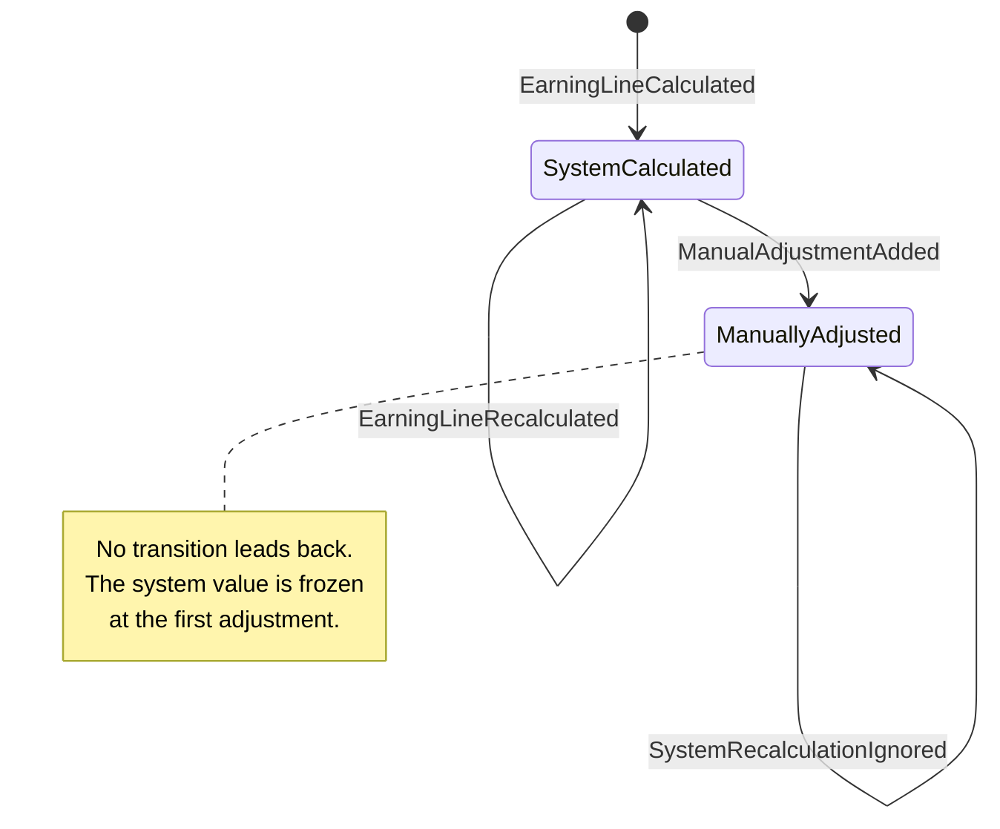

# Earning-Line Manual Adjustments — Implementation Plan

> **For agentic workers:** REQUIRED SUB-SKILL: Use superpowers:subagent-driven-development (recommended) or superpowers:executing-plans to implement this plan task-by-task. Steps use checkbox (`- [ ]`) syntax for tracking.

**Goal:** Build an event-sourced domain model for a payroll earning line whose automatically calculated value can be corrected by a payroll specialist, where corrections are append-only and permanently override system recalculation.

**Architecture:** Hand-written event-sourced aggregate (`EarningLine`) behind a domain repository port, with an in-memory append-only event store and optimistic concurrency. Write side goes through commands and invokable handlers; the read side folds the raw event stream into an `AuditHistoryView` without loading the aggregate. Hexagonal layering — `Infrastructure → Application → Domain` — enforced by a test.

**Tech Stack:** PHP 8.5, Composer autoload only, `psr/clock` as the single runtime dependency. PHPUnit 12, PHPStan 2 at level max with strict rules, PHP-CS-Fixer with `@PER-CS` + `@PHP8x5Migration`. No framework, no event-sourcing library.

**Spec:** `docs/superpowers/specs/2026-09-16-earning-line-adjustments-design.md`

## Global Constraints

Every task's requirements implicitly include this section.

- `declare(strict_types=1);` in every PHP file, including tests and `bin/scenario.php`.
- **Never use float anywhere** — not in source, not in parsing, not in tests. Money is `int` minor units.
- `final` by default. `readonly` classes for value objects, events, commands and views.
- `#[\Override]` on every method implementing an interface or overriding a parent.
- `#[\NoDiscard]` on `Money::add()`, `Money::negate()` and `EarningLine::pullRecordedEvents()`.
- No PHPStan baseline, no `@phpstan-ignore`, no `@codeCoverageIgnore`.
- Docblocks only for generics (`@return list<DomainEvent>`) and for *why*. Never repeat a type the signature already states.
- Comments are rare and explain *why*, never *what*.
- Namespace root: `Alcor\Payroll\` → `src/`, `Alcor\Payroll\Tests\` → `tests/`.
- Dependencies are injected through constructors and interfaces. No container. `bin/scenario.php` is the only composition root.
- Do not add a Composer package beyond `psr/clock` without asking.
- Every command runs **inside the container**: `docker compose run --rm php <cmd>`. Only `composer install` / `composer require` run on the host.
- `composer check` must be green before every commit. Never commit red.
- One logical change per commit, Conventional Commits, imperative mood, subject ≤ 72 chars. Commit bodies explain *why* when non-obvious.
- Test names state business rules, e.g. `test_recalculation_is_ignored_once_line_has_manual_adjustment()`.
- Aggregate tests are **given** (past events) / **when** (behaviour) / **then** (recorded events or exception). Assert on recorded events, never on private state.
- No mocks of domain objects. Real value objects and in-memory fakes only.
- Never edit `ReferenceScenarioTest` expectations to make code pass.

## Verified Environment Facts

These were probed in the container before this plan was written. Do not re-litigate them.

- PHP 8.5 accepts the pipe operator `|>`, `clone($o, [...])`, `#[\NoDiscard]`, first-class callables, and **interface properties** (`public DateTimeImmutable $occurredAt { get; }`), and PHPStan level max accepts all of them.
- `ext-mbstring` is loaded on the host and in the `php:8.5-cli` image.
- **PHPStan level max rejects `match (true)` without a `default` arm** ("Match expression does not handle remaining value: true"). Every `match (true)` dispatch therefore ends with `default => throw new \LogicException(...)`. That arm is covered by a test that passes an anonymous `DomainEvent` implementation, so no `@codeCoverageIgnore` is needed.

## Additions Beyond the Spec

Two small pieces the spec implies but does not name. Both are listed here so a reviewer sees them as deliberate:

1. `Currency::fromCode(string): self` throwing `UnsupportedCurrency` (a `DomainException`). Handlers receive a currency as a `string`; bare `Currency::from()` throws `\ValueError`, which is not a `DomainException` and would break the promise that the application boundary can `catch (DomainException)`.
2. `EarningLine::id(): EarningLineId`. The repository needs the stream id when saving.

## File Structure

```
src/
  Domain/
    Shared/
      Currency.php                 enum: ISO 4217 code + minorUnits()
      DomainEvent.php              interface: occurredAt property
      DomainException.php          interface: marker over \Throwable
      Money.php                    int minor units + Currency; all arithmetic
      Exception/
        CurrencyMismatch.php
        InvalidMoneyAmount.php
        UnsupportedCurrency.php
    EarningLine/
      AdjustmentNumber.php         positive int, sequential per line
      Comment.php                  trimmed, non-empty, <= 500 chars
      EarningLine.php              aggregate root; the only place rules live
      EarningLineId.php            RFC 4122 UUID, lowercase-normalised
      EarningLineRepository.php    domain port: exists / get / save
      LineStatus.php               enum: SystemCalculated | ManuallyAdjusted
      SpecialistId.php             opaque id, <= 100 chars
      Event/
        EarningLineCalculated.php
        EarningLineRecalculated.php
        ManualAdjustmentAdded.php
        SystemRecalculationIgnored.php
      Exception/
        EarningLineAlreadyExists.php
        EarningLineNotFound.php
        InvalidAdjustmentNumber.php
        InvalidComment.php
        InvalidEarningLineId.php
        InvalidSpecialistId.php
        UnknownAdjustment.php
        ZeroAdjustmentNotAllowed.php
  Application/
    Port/
      ConcurrencyConflict.php      version race only
      EventStore.php               append-only port with expected version
    Command/
      AddManualAdjustment.php            + AddManualAdjustmentHandler.php
      CalculateEarningLine.php           + CalculateEarningLineHandler.php
      RecalculateEarningLine.php         + RecalculateEarningLineHandler.php
    Query/
      AdjustmentEntry.php          read-model row
      AuditHistoryProjection.php   single-pass fold over the stream
      AuditHistoryView.php         read model
      GetEarningLineAudit.php            + GetEarningLineAuditHandler.php
      IgnoredRecalculation.php     read-model row
  Infrastructure/
    Clock/SystemClock.php
    Cli/AuditTableRenderer.php
    Cli/MoneyFormatter.php
    Identity/UuidV4.php            used only by bin/scenario.php
    Persistence/EventSourcedEarningLineRepository.php
    Persistence/InMemoryEventStore.php
bin/scenario.php
tests/
  Acceptance/ReferenceScenarioTest.php
  Architecture/LayerDependencyTest.php
  Integration/EventSourcedEarningLineRepositoryTest.php
  Integration/InMemoryEventStoreTest.php
  Support/EarningLineScenario.php  given/when/then helper
  Support/FrozenClock.php
  Support/TestIds.php              fixed UUID constants
  Unit/Application/...
  Unit/Domain/...
```

---
### Task 1: Money and Currency

Implements spec §4.1. Corresponds to `docs/docs.md` phase 2.

**Files:**
- Create: `src/Domain/Shared/DomainException.php`
- Create: `src/Domain/Shared/Currency.php`
- Create: `src/Domain/Shared/Exception/InvalidMoneyAmount.php`
- Create: `src/Domain/Shared/Exception/CurrencyMismatch.php`
- Create: `src/Domain/Shared/Exception/UnsupportedCurrency.php`
- Create: `src/Domain/Shared/Money.php`
- Test: `tests/Unit/Domain/Shared/CurrencyTest.php`
- Test: `tests/Unit/Domain/Shared/MoneyTest.php`

**Interfaces:**
- Consumes: nothing.
- Produces:
  - `interface DomainException extends \Throwable`
  - `enum Currency: string { case USD; case EUR; case GBP }` with `minorUnits(): int` and `static fromCode(string $code): self`
  - `final readonly class Money` with public `int $minor`, public `Currency $currency`, and `static ofMinor(int, Currency): self`, `static zero(Currency): self`, `static fromDecimal(string, Currency): self`, `add(Money): Money`, `negate(): Money`, `isZero(): bool`, `equals(Money): bool`
  - `InvalidMoneyAmount::notDecimal(string $amount, Currency $currency): self`, `::outOfRange(string $amount): self`, `::overflow(): self`
  - `CurrencyMismatch::between(Currency $expected, Currency $actual): self`
  - `UnsupportedCurrency::code(string $code): self`

- [ ] **Step 1: Write the failing Currency test**

Create `tests/Unit/Domain/Shared/CurrencyTest.php`:

```php
<?php

declare(strict_types=1);

namespace Alcor\Payroll\Tests\Unit\Domain\Shared;

use Alcor\Payroll\Domain\Shared\Currency;
use Alcor\Payroll\Domain\Shared\Exception\UnsupportedCurrency;
use PHPUnit\Framework\TestCase;

final class CurrencyTest extends TestCase
{
    public function test_supported_currencies_use_two_minor_units(): void
    {
        foreach (Currency::cases() as $currency) {
            self::assertSame(2, $currency->minorUnits());
        }
    }

    public function test_it_is_built_from_an_iso_4217_code(): void
    {
        self::assertSame(Currency::USD, Currency::fromCode('USD'));
    }

    public function test_an_unsupported_code_is_rejected_as_a_domain_error(): void
    {
        $this->expectException(UnsupportedCurrency::class);

        Currency::fromCode('XYZ');
    }
}
```

- [ ] **Step 2: Run it and watch it fail**

Run: `docker compose run --rm php vendor/bin/phpunit --testsuite unit`
Expected: FAIL — `Class "Alcor\Payroll\Domain\Shared\Currency" not found`.

- [ ] **Step 3: Write `DomainException` and `Currency`**

`src/Domain/Shared/DomainException.php`:

```php
<?php

declare(strict_types=1);

namespace Alcor\Payroll\Domain\Shared;

/**
 * Marker for every error the domain raises on purpose, so an application
 * boundary can tell a rule violation from a programming mistake.
 */
interface DomainException extends \Throwable
{
}
```

`src/Domain/Shared/Exception/UnsupportedCurrency.php`:

```php
<?php

declare(strict_types=1);

namespace Alcor\Payroll\Domain\Shared\Exception;

use Alcor\Payroll\Domain\Shared\DomainException;

final class UnsupportedCurrency extends \InvalidArgumentException implements DomainException
{
    public static function code(string $code): self
    {
        return new self(sprintf('Currency "%s" is not supported.', $code));
    }
}
```

`src/Domain/Shared/Currency.php`:

```php
<?php

declare(strict_types=1);

namespace Alcor\Payroll\Domain\Shared;

use Alcor\Payroll\Domain\Shared\Exception\UnsupportedCurrency;

enum Currency: string
{
    case USD = 'USD';
    case EUR = 'EUR';
    case GBP = 'GBP';

    /**
     * Precision is asked of the currency rather than assumed, so a 0- or
     * 3-decimal currency can be added without touching Money.
     */
    public function minorUnits(): int
    {
        return match ($this) {
            self::USD, self::EUR, self::GBP => 2,
        };
    }

    public static function fromCode(string $code): self
    {
        return self::tryFrom($code) ?? throw UnsupportedCurrency::code($code);
    }
}
```

- [ ] **Step 4: Run the Currency test**

Run: `docker compose run --rm php vendor/bin/phpunit --testsuite unit`
Expected: PASS, 3 tests.

- [ ] **Step 5: Write the failing Money test**

Create `tests/Unit/Domain/Shared/MoneyTest.php`:

```php
<?php

declare(strict_types=1);

namespace Alcor\Payroll\Tests\Unit\Domain\Shared;

use Alcor\Payroll\Domain\Shared\Currency;
use Alcor\Payroll\Domain\Shared\Exception\CurrencyMismatch;
use Alcor\Payroll\Domain\Shared\Exception\InvalidMoneyAmount;
use Alcor\Payroll\Domain\Shared\Money;
use PHPUnit\Framework\Attributes\DataProvider;
use PHPUnit\Framework\TestCase;

final class MoneyTest extends TestCase
{
    /**
     * @return iterable<string, array{string, int}>
     */
    public static function validDecimals(): iterable
    {
        yield 'whole amount' => ['1000.00', 100_000];
        yield 'no decimal point' => ['1050', 105_000];
        yield 'one decimal' => ['1.5', 150];
        yield 'negative' => ['-45.55', -4_555];
        yield 'explicit plus' => ['+100.10', 10_010];
        yield 'negative below one' => ['-0.10', -10];
        yield 'zero' => ['0.00', 0];
        yield 'negative zero is zero' => ['-0.00', 0];
        yield 'leading zeros' => ['0001.05', 105];
    }

    #[DataProvider('validDecimals')]
    public function test_it_parses_a_decimal_string_into_minor_units(string $amount, int $expected): void
    {
        self::assertSame($expected, Money::fromDecimal($amount, Currency::USD)->minor);
    }

    /**
     * @return iterable<string, array{string}>
     */
    public static function invalidDecimals(): iterable
    {
        yield 'too many decimals' => ['1.005'];
        yield 'not a number' => ['abc'];
        yield 'empty' => [''];
        yield 'leading space' => [' 1.00'];
        yield 'trailing point' => ['1.'];
        yield 'no integer digit' => ['.5'];
        yield 'comma separator' => ['1,00'];
        yield 'scientific notation' => ['1e2'];
        yield 'double sign' => ['--1.00'];
        yield 'sign only' => ['-'];
        yield 'out of int range' => ['99999999999999999999.00'];
    }

    #[DataProvider('invalidDecimals')]
    public function test_it_rejects_anything_that_is_not_an_exact_decimal(string $amount): void
    {
        $this->expectException(InvalidMoneyAmount::class);

        Money::fromDecimal($amount, Currency::USD);
    }

    public function test_it_adds_amounts_of_the_same_currency(): void
    {
        $sum = Money::fromDecimal('1050.00', Currency::USD)
            ->add(Money::fromDecimal('-45.55', Currency::USD));

        self::assertSame(100_445, $sum->minor);
    }

    public function test_adding_leaves_the_original_untouched(): void
    {
        $original = Money::fromDecimal('10.00', Currency::USD);
        $original->add(Money::fromDecimal('1.00', Currency::USD));

        self::assertSame(1_000, $original->minor);
    }

    public function test_adding_a_different_currency_is_refused(): void
    {
        $this->expectException(CurrencyMismatch::class);

        Money::fromDecimal('1.00', Currency::USD)->add(Money::fromDecimal('1.00', Currency::EUR));
    }

    public function test_addition_that_would_leave_the_integer_range_is_refused(): void
    {
        $this->expectException(InvalidMoneyAmount::class);

        Money::ofMinor(\PHP_INT_MAX, Currency::USD)->add(Money::ofMinor(1, Currency::USD));
    }

    public function test_subtraction_that_would_leave_the_integer_range_is_refused(): void
    {
        $this->expectException(InvalidMoneyAmount::class);

        Money::ofMinor(\PHP_INT_MIN, Currency::USD)->add(Money::ofMinor(-1, Currency::USD));
    }

    public function test_it_negates(): void
    {
        self::assertSame(4_555, Money::fromDecimal('-45.55', Currency::USD)->negate()->minor);
    }

    public function test_negating_the_smallest_integer_is_refused(): void
    {
        $this->expectException(InvalidMoneyAmount::class);

        Money::ofMinor(\PHP_INT_MIN, Currency::USD)->negate();
    }

    public function test_zero_is_zero(): void
    {
        self::assertTrue(Money::zero(Currency::USD)->isZero());
        self::assertFalse(Money::ofMinor(1, Currency::USD)->isZero());
    }

    public function test_equality_covers_both_amount_and_currency(): void
    {
        $tenUsd = Money::fromDecimal('10.00', Currency::USD);

        self::assertTrue($tenUsd->equals(Money::fromDecimal('10.00', Currency::USD)));
        self::assertFalse($tenUsd->equals(Money::fromDecimal('10.01', Currency::USD)));
        self::assertFalse($tenUsd->equals(Money::fromDecimal('10.00', Currency::EUR)));
    }
}
```

- [ ] **Step 6: Run it and watch it fail**

Run: `docker compose run --rm php vendor/bin/phpunit --testsuite unit`
Expected: FAIL — `Class "Alcor\Payroll\Domain\Shared\Money" not found`.

- [ ] **Step 7: Write the money exceptions**

`src/Domain/Shared/Exception/InvalidMoneyAmount.php`:

```php
<?php

declare(strict_types=1);

namespace Alcor\Payroll\Domain\Shared\Exception;

use Alcor\Payroll\Domain\Shared\Currency;
use Alcor\Payroll\Domain\Shared\DomainException;

final class InvalidMoneyAmount extends \InvalidArgumentException implements DomainException
{
    public static function notDecimal(string $amount, Currency $currency): self
    {
        return new self(sprintf(
            'Expected a decimal amount with at most %d decimal places, got "%s".',
            $currency->minorUnits(),
            $amount,
        ));
    }

    public static function outOfRange(string $amount): self
    {
        return new self(sprintf('Amount "%s" does not fit in the supported range.', $amount));
    }

    public static function overflow(): self
    {
        return new self('The resulting amount does not fit in the supported range.');
    }
}
```

`src/Domain/Shared/Exception/CurrencyMismatch.php`:

```php
<?php

declare(strict_types=1);

namespace Alcor\Payroll\Domain\Shared\Exception;

use Alcor\Payroll\Domain\Shared\Currency;
use Alcor\Payroll\Domain\Shared\DomainException;

final class CurrencyMismatch extends \InvalidArgumentException implements DomainException
{
    public static function between(Currency $expected, Currency $actual): self
    {
        return new self(sprintf(
            'Expected %s, got %s. A line carries one currency for its lifetime.',
            $expected->value,
            $actual->value,
        ));
    }
}
```

- [ ] **Step 8: Write `Money`**

`src/Domain/Shared/Money.php`:

```php
<?php

declare(strict_types=1);

namespace Alcor\Payroll\Domain\Shared;

use Alcor\Payroll\Domain\Shared\Exception\CurrencyMismatch;
use Alcor\Payroll\Domain\Shared\Exception\InvalidMoneyAmount;

final readonly class Money
{
    private function __construct(
        public int $minor,
        public Currency $currency,
    ) {
    }

    public static function ofMinor(int $minor, Currency $currency): self
    {
        return new self($minor, $currency);
    }

    public static function zero(Currency $currency): self
    {
        return new self(0, $currency);
    }

    public static function fromDecimal(string $amount, Currency $currency): self
    {
        $scale = $currency->minorUnits();
        $fraction = $scale > 0 ? sprintf('(?:\.(?<fraction>\d{1,%d}))?', $scale) : '';

        if (preg_match('/^(?<sign>[+-])?(?<units>\d+)' . $fraction . '$/', $amount, $matches) !== 1) {
            throw InvalidMoneyAmount::notDecimal($amount, $currency);
        }

        $digits = ltrim($matches['units'] . str_pad($matches['fraction'] ?? '', $scale, '0'), '0');

        if ($digits === '') {
            return new self(0, $currency);
        }

        if (self::exceedsIntegerRange($digits)) {
            throw InvalidMoneyAmount::outOfRange($amount);
        }

        $minor = (int) $digits;

        return new self(($matches['sign'] ?? '') === '-' ? -$minor : $minor, $currency);
    }

    #[\NoDiscard]
    public function add(self $other): self
    {
        if ($this->currency !== $other->currency) {
            throw CurrencyMismatch::between($this->currency, $other->currency);
        }

        // Checked before adding: an overflowing + yields a float in PHP, and
        // floats are banned here precisely because they lose cents silently.
        if ($other->minor > 0 && $this->minor > \PHP_INT_MAX - $other->minor) {
            throw InvalidMoneyAmount::overflow();
        }

        if ($other->minor < 0 && $this->minor < \PHP_INT_MIN - $other->minor) {
            throw InvalidMoneyAmount::overflow();
        }

        return new self($this->minor + $other->minor, $this->currency);
    }

    #[\NoDiscard]
    public function negate(): self
    {
        if ($this->minor === \PHP_INT_MIN) {
            throw InvalidMoneyAmount::overflow();
        }

        return new self(-$this->minor, $this->currency);
    }

    public function isZero(): bool
    {
        return $this->minor === 0;
    }

    public function equals(self $other): bool
    {
        return $this->minor === $other->minor && $this->currency === $other->currency;
    }

    /**
     * Compares digit strings rather than casting, because casting an oversized
     * numeric string silently yields PHP_INT_MAX.
     */
    private static function exceedsIntegerRange(string $digits): bool
    {
        $max = (string) \PHP_INT_MAX;

        return strlen($digits) > strlen($max)
            || (strlen($digits) === strlen($max) && strcmp($digits, $max) > 0);
    }
}
```

- [ ] **Step 9: Run the tests**

Run: `docker compose run --rm php vendor/bin/phpunit --testsuite unit`
Expected: PASS, with no test skipped or marked risky.

If PHPStan later objects to `$matches['fraction'] ?? ''` ("offset always exists" or "offset might not exist"), keep the parsing behaviour and adjust only the expression — for example capture into a local via `$matches['fraction'] ?? ''` guarded by `$scale > 0`. Do not weaken the rejection rules to satisfy the analyser.

- [ ] **Step 10: Run the full check**

Run: `docker compose run --rm php composer check`
Expected: cs clean, PHPStan clean, tests green.

- [ ] **Step 11: Commit**

```bash
git add src/Domain/Shared tests/Unit/Domain/Shared
git commit -m "feat(domain): add Money and Currency

Money stores integer minor units and asks the currency for its own
precision, so no scale literal appears in the arithmetic. Parsing is
exact string matching: it accepts an optional sign and at most the
currency's number of decimals, and rejects oversized values by comparing
digit strings, because casting an oversized numeric string silently
yields PHP_INT_MAX. Addition and negation refuse to leave the integer
range for the same reason — a wrapped total is a correctness bug."
```

---
### Task 2: Line value objects

Implements spec §4.2 (value objects only). Corresponds to `docs/docs.md` phase 3.

**Files:**
- Create: `src/Domain/EarningLine/Comment.php`
- Create: `src/Domain/EarningLine/EarningLineId.php`
- Create: `src/Domain/EarningLine/SpecialistId.php`
- Create: `src/Domain/EarningLine/AdjustmentNumber.php`
- Create: `src/Domain/EarningLine/Exception/InvalidComment.php`
- Create: `src/Domain/EarningLine/Exception/InvalidEarningLineId.php`
- Create: `src/Domain/EarningLine/Exception/InvalidSpecialistId.php`
- Create: `src/Domain/EarningLine/Exception/InvalidAdjustmentNumber.php`
- Create: `tests/Support/TestIds.php`
- Modify: `composer.json` — add `"ext-mbstring": "*"` to `require`
- Test: `tests/Unit/Domain/EarningLine/CommentTest.php`
- Test: `tests/Unit/Domain/EarningLine/EarningLineIdTest.php`
- Test: `tests/Unit/Domain/EarningLine/SpecialistIdTest.php`
- Test: `tests/Unit/Domain/EarningLine/AdjustmentNumberTest.php`

`ext-mbstring` is a platform requirement, not a Composer package — length limits are counted in characters, not bytes, so a comment full of Cyrillic is not rejected for being "too long".

**Interfaces:**
- Consumes: `DomainException` from Task 1.
- Produces:
  - `final readonly class Comment` — `__construct(string $value)`, public `string $value`, `public const int MAX_LENGTH = 500`
  - `final readonly class EarningLineId` — `__construct(string $value)`, public `string $value`, `equals(self): bool`
  - `final readonly class SpecialistId` — `__construct(string $value)`, public `string $value`, `public const int MAX_LENGTH = 100`, `equals(self): bool`
  - `final readonly class AdjustmentNumber` — `__construct(int $value)`, public `int $value`, `static first(): self`, `next(): self`, `equals(self): bool`
  - `final class TestIds` with `public const string LINE`, `LINE_OTHER`, `SPECIALIST`

- [ ] **Step 1: Write the failing Comment test**

Create `tests/Unit/Domain/EarningLine/CommentTest.php`:

```php
<?php

declare(strict_types=1);

namespace Alcor\Payroll\Tests\Unit\Domain\EarningLine;

use Alcor\Payroll\Domain\EarningLine\Comment;
use Alcor\Payroll\Domain\EarningLine\Exception\InvalidComment;
use PHPUnit\Framework\Attributes\DataProvider;
use PHPUnit\Framework\TestCase;

final class CommentTest extends TestCase
{
    public function test_it_keeps_the_explanation_the_specialist_typed(): void
    {
        $comment = new Comment('Employee declined dental benefit; reversing deduction');

        self::assertSame('Employee declined dental benefit; reversing deduction', $comment->value);
    }

    public function test_it_trims_surrounding_whitespace(): void
    {
        self::assertSame('Late correction', (new Comment("  Late correction \n"))->value);
    }

    /**
     * @return iterable<string, array{string}>
     */
    public static function blankComments(): iterable
    {
        yield 'empty' => [''];
        yield 'spaces' => ['   '];
        yield 'tab and newline' => ["\t\n"];
    }

    #[DataProvider('blankComments')]
    public function test_an_adjustment_may_not_be_explained_by_nothing(string $value): void
    {
        $this->expectException(InvalidComment::class);

        new Comment($value);
    }

    public function test_it_accepts_the_longest_allowed_comment(): void
    {
        self::assertSame(Comment::MAX_LENGTH, mb_strlen((new Comment(str_repeat('a', Comment::MAX_LENGTH)))->value));
    }

    public function test_it_rejects_a_comment_one_character_too_long(): void
    {
        $this->expectException(InvalidComment::class);

        new Comment(str_repeat('a', Comment::MAX_LENGTH + 1));
    }

    public function test_length_is_counted_in_characters_not_bytes(): void
    {
        $multibyte = str_repeat('я', Comment::MAX_LENGTH);

        self::assertSame($multibyte, (new Comment($multibyte))->value);
    }
}
```

- [ ] **Step 2: Run it and watch it fail**

Run: `docker compose run --rm php vendor/bin/phpunit --testsuite unit`
Expected: FAIL — `Class "Alcor\Payroll\Domain\EarningLine\Comment" not found`.

- [ ] **Step 3: Write `InvalidComment` and `Comment`**

`src/Domain/EarningLine/Exception/InvalidComment.php`:

```php
<?php

declare(strict_types=1);

namespace Alcor\Payroll\Domain\EarningLine\Exception;

use Alcor\Payroll\Domain\Shared\DomainException;

final class InvalidComment extends \InvalidArgumentException implements DomainException
{
    public static function blank(): self
    {
        return new self('An adjustment must explain itself: the comment is mandatory.');
    }

    public static function tooLong(int $length, int $limit): self
    {
        return new self(sprintf('A comment may be at most %d characters, got %d.', $limit, $length));
    }
}
```

`src/Domain/EarningLine/Comment.php`:

```php
<?php

declare(strict_types=1);

namespace Alcor\Payroll\Domain\EarningLine;

use Alcor\Payroll\Domain\EarningLine\Exception\InvalidComment;

final readonly class Comment
{
    public const int MAX_LENGTH = 500;

    public string $value;

    public function __construct(string $value)
    {
        $trimmed = trim($value);

        if ($trimmed === '') {
            throw InvalidComment::blank();
        }

        $length = mb_strlen($trimmed);

        if ($length > self::MAX_LENGTH) {
            throw InvalidComment::tooLong($length, self::MAX_LENGTH);
        }

        $this->value = $trimmed;
    }
}
```

- [ ] **Step 4: Run the Comment test**

Run: `docker compose run --rm php vendor/bin/phpunit --testsuite unit`
Expected: PASS.

- [ ] **Step 5: Write the failing identity tests**

Create `tests/Unit/Domain/EarningLine/EarningLineIdTest.php`:

```php
<?php

declare(strict_types=1);

namespace Alcor\Payroll\Tests\Unit\Domain\EarningLine;

use Alcor\Payroll\Domain\EarningLine\EarningLineId;
use Alcor\Payroll\Domain\EarningLine\Exception\InvalidEarningLineId;
use PHPUnit\Framework\Attributes\DataProvider;
use PHPUnit\Framework\TestCase;

final class EarningLineIdTest extends TestCase
{
    private const string VALID = '018f3a2c-5b7e-4d9a-9c1f-2e6b8a4d0f31';

    public function test_it_accepts_an_rfc_4122_uuid(): void
    {
        self::assertSame(self::VALID, (new EarningLineId(self::VALID))->value);
    }

    public function test_it_normalises_case_so_two_spellings_are_one_identity(): void
    {
        $upper = new EarningLineId(strtoupper(self::VALID));

        self::assertSame(self::VALID, $upper->value);
        self::assertTrue($upper->equals(new EarningLineId(self::VALID)));
    }

    public function test_different_uuids_are_different_identities(): void
    {
        $other = new EarningLineId('018f3a2c-5b7e-4d9a-9c1f-2e6b8a4d0f32');

        self::assertFalse((new EarningLineId(self::VALID))->equals($other));
    }

    /**
     * @return iterable<string, array{string}>
     */
    public static function invalidIds(): iterable
    {
        yield 'empty' => [''];
        yield 'not a uuid' => ['line-1'];
        yield 'missing a group' => ['018f3a2c-5b7e-4d9a-9c1f'];
        yield 'nil uuid has no version' => ['00000000-0000-0000-0000-000000000000'];
        yield 'bad variant' => ['018f3a2c-5b7e-4d9a-1c1f-2e6b8a4d0f31'];
        yield 'not hexadecimal' => ['018f3a2c-5b7e-4d9a-9c1f-2e6b8a4d0fzz'];
        yield 'braced' => ['{018f3a2c-5b7e-4d9a-9c1f-2e6b8a4d0f31}'];
    }

    #[DataProvider('invalidIds')]
    public function test_identity_must_be_a_uuid(string $value): void
    {
        $this->expectException(InvalidEarningLineId::class);

        new EarningLineId($value);
    }
}
```

Create `tests/Unit/Domain/EarningLine/SpecialistIdTest.php`:

```php
<?php

declare(strict_types=1);

namespace Alcor\Payroll\Tests\Unit\Domain\EarningLine;

use Alcor\Payroll\Domain\EarningLine\Exception\InvalidSpecialistId;
use Alcor\Payroll\Domain\EarningLine\SpecialistId;
use PHPUnit\Framework\TestCase;

final class SpecialistIdTest extends TestCase
{
    public function test_it_is_an_opaque_identifier_from_another_context(): void
    {
        self::assertSame('okta|00u1a2b3c4', (new SpecialistId('okta|00u1a2b3c4'))->value);
    }

    public function test_it_trims_surrounding_whitespace(): void
    {
        self::assertSame('alice', (new SpecialistId(' alice '))->value);
    }

    public function test_an_adjustment_must_name_who_made_it(): void
    {
        $this->expectException(InvalidSpecialistId::class);

        new SpecialistId('   ');
    }

    public function test_it_rejects_an_identifier_one_character_too_long(): void
    {
        $this->expectException(InvalidSpecialistId::class);

        new SpecialistId(str_repeat('a', SpecialistId::MAX_LENGTH + 1));
    }

    public function test_equality_compares_the_identifier(): void
    {
        self::assertTrue((new SpecialistId('alice'))->equals(new SpecialistId('alice')));
        self::assertFalse((new SpecialistId('alice'))->equals(new SpecialistId('bob')));
    }
}
```

Create `tests/Unit/Domain/EarningLine/AdjustmentNumberTest.php`:

```php
<?php

declare(strict_types=1);

namespace Alcor\Payroll\Tests\Unit\Domain\EarningLine;

use Alcor\Payroll\Domain\EarningLine\AdjustmentNumber;
use Alcor\Payroll\Domain\EarningLine\Exception\InvalidAdjustmentNumber;
use PHPUnit\Framework\Attributes\DataProvider;
use PHPUnit\Framework\TestCase;

final class AdjustmentNumberTest extends TestCase
{
    public function test_the_first_adjustment_on_a_line_is_number_one(): void
    {
        self::assertSame(1, AdjustmentNumber::first()->value);
    }

    public function test_numbers_run_in_sequence(): void
    {
        self::assertSame(2, AdjustmentNumber::first()->next()->value);
        self::assertSame(3, AdjustmentNumber::first()->next()->next()->value);
    }

    public function test_next_leaves_the_original_untouched(): void
    {
        $first = AdjustmentNumber::first();
        $first->next();

        self::assertSame(1, $first->value);
    }

    /**
     * @return iterable<string, array{int}>
     */
    public static function nonPositiveNumbers(): iterable
    {
        yield 'zero' => [0];
        yield 'negative' => [-1];
    }

    #[DataProvider('nonPositiveNumbers')]
    public function test_adjustments_are_numbered_from_one(int $value): void
    {
        $this->expectException(InvalidAdjustmentNumber::class);

        new AdjustmentNumber($value);
    }

    public function test_equality_compares_the_number(): void
    {
        self::assertTrue((new AdjustmentNumber(4))->equals(new AdjustmentNumber(4)));
        self::assertFalse((new AdjustmentNumber(4))->equals(new AdjustmentNumber(5)));
    }
}
```

- [ ] **Step 6: Run them and watch them fail**

Run: `docker compose run --rm php vendor/bin/phpunit --testsuite unit`
Expected: FAIL — the three new classes are not found.

- [ ] **Step 7: Write the identity exceptions**

`src/Domain/EarningLine/Exception/InvalidEarningLineId.php`:

```php
<?php

declare(strict_types=1);

namespace Alcor\Payroll\Domain\EarningLine\Exception;

use Alcor\Payroll\Domain\Shared\DomainException;

final class InvalidEarningLineId extends \InvalidArgumentException implements DomainException
{
    public static function notAUuid(string $value): self
    {
        return new self(sprintf('An earning line id must be a UUID, got "%s".', $value));
    }
}
```

`src/Domain/EarningLine/Exception/InvalidSpecialistId.php`:

```php
<?php

declare(strict_types=1);

namespace Alcor\Payroll\Domain\EarningLine\Exception;

use Alcor\Payroll\Domain\Shared\DomainException;

final class InvalidSpecialistId extends \InvalidArgumentException implements DomainException
{
    public static function blank(): self
    {
        return new self('An adjustment must record who made it.');
    }

    public static function tooLong(int $length, int $limit): self
    {
        return new self(sprintf('A specialist id may be at most %d characters, got %d.', $limit, $length));
    }
}
```

`src/Domain/EarningLine/Exception/InvalidAdjustmentNumber.php`:

```php
<?php

declare(strict_types=1);

namespace Alcor\Payroll\Domain\EarningLine\Exception;

use Alcor\Payroll\Domain\Shared\DomainException;

final class InvalidAdjustmentNumber extends \InvalidArgumentException implements DomainException
{
    public static function notPositive(int $value): self
    {
        return new self(sprintf('Adjustments are numbered from 1, got %d.', $value));
    }
}
```

- [ ] **Step 8: Write the three value objects**

`src/Domain/EarningLine/EarningLineId.php`:

```php
<?php

declare(strict_types=1);

namespace Alcor\Payroll\Domain\EarningLine;

use Alcor\Payroll\Domain\EarningLine\Exception\InvalidEarningLineId;

final readonly class EarningLineId
{
    /** Versions 1-8 and the RFC 4122 variant; the nil UUID is not an identity. */
    private const string PATTERN = '/^[0-9a-f]{8}-[0-9a-f]{4}-[1-8][0-9a-f]{3}-[89ab][0-9a-f]{3}-[0-9a-f]{12}$/';

    public string $value;

    public function __construct(string $value)
    {
        $normalised = strtolower(trim($value));

        if (preg_match(self::PATTERN, $normalised) !== 1) {
            throw InvalidEarningLineId::notAUuid($value);
        }

        $this->value = $normalised;
    }

    public function equals(self $other): bool
    {
        return $this->value === $other->value;
    }
}
```

`src/Domain/EarningLine/SpecialistId.php`:

```php
<?php

declare(strict_types=1);

namespace Alcor\Payroll\Domain\EarningLine;

use Alcor\Payroll\Domain\EarningLine\Exception\InvalidSpecialistId;

/**
 * Opaque: the identity of a specialist belongs to another bounded context,
 * so this asserts presence and a sane length, and assumes no format.
 */
final readonly class SpecialistId
{
    public const int MAX_LENGTH = 100;

    public string $value;

    public function __construct(string $value)
    {
        $trimmed = trim($value);

        if ($trimmed === '') {
            throw InvalidSpecialistId::blank();
        }

        $length = mb_strlen($trimmed);

        if ($length > self::MAX_LENGTH) {
            throw InvalidSpecialistId::tooLong($length, self::MAX_LENGTH);
        }

        $this->value = $trimmed;
    }

    public function equals(self $other): bool
    {
        return $this->value === $other->value;
    }
}
```

`src/Domain/EarningLine/AdjustmentNumber.php`:

```php
<?php

declare(strict_types=1);

namespace Alcor\Payroll\Domain\EarningLine;

use Alcor\Payroll\Domain\EarningLine\Exception\InvalidAdjustmentNumber;

/**
 * Sequential per line, so it matches the "adjustment #4" language the
 * business already uses when one correction compensates another.
 */
final readonly class AdjustmentNumber
{
    public function __construct(public int $value)
    {
        if ($value < 1) {
            throw InvalidAdjustmentNumber::notPositive($value);
        }
    }

    public static function first(): self
    {
        return new self(1);
    }

    public function next(): self
    {
        return new self($this->value + 1);
    }

    public function equals(self $other): bool
    {
        return $this->value === $other->value;
    }
}
```

- [ ] **Step 9: Write the shared test ids**

Create `tests/Support/TestIds.php`:

```php
<?php

declare(strict_types=1);

namespace Alcor\Payroll\Tests\Support;

/**
 * Fixed identities: the domain never generates a UUID, so tests supply one
 * and stay deterministic.
 */
final class TestIds
{
    public const string LINE = '018f3a2c-5b7e-4d9a-9c1f-2e6b8a4d0f31';
    public const string LINE_OTHER = '018f3a2c-5b7e-4d9a-9c1f-2e6b8a4d0f32';
    public const string SPECIALIST = 'specialist-alice';
}
```

- [ ] **Step 10: Declare the mbstring platform requirement**

In `composer.json`, `require` becomes:

```json
    "require": {
        "php": "^8.5",
        "ext-mbstring": "*",
        "psr/clock": "^1.0"
    },
```

Then run on the **host** (the one exception to the container rule):

```bash
composer update --lock
```

- [ ] **Step 11: Run the full check**

Run: `docker compose run --rm php composer check`
Expected: cs clean, PHPStan clean, all unit tests green.

- [ ] **Step 12: Commit**

```bash
git add src/Domain/EarningLine tests/Unit/Domain/EarningLine tests/Support composer.json composer.lock
git commit -m "feat(domain): add the earning line value objects

Comment, EarningLineId, SpecialistId and AdjustmentNumber are valid by
construction, so no caller can assemble a nameless, uncommented or
zero-numbered adjustment.

Identity is a client-supplied UUID: the domain validates and normalises
it but never generates one, which keeps randomness out of the model and
tests deterministic. SpecialistId stays opaque because the specialist
belongs to an identity context this model does not own. Lengths are
counted in characters, hence the ext-mbstring requirement."
```

---
### Task 3: The aggregate — calculation and recalculation

Implements spec §4.4 and §4.5, plus the first two rows of §4.3. Corresponds to `docs/docs.md` phase 4.

Only what these tests need gets written. `LineStatus`, the freeze rule and `addAdjustment()` arrive in Task 4 with the tests that demand them — an aggregate with an unreachable `ManuallyAdjusted` branch would be untested code pretending to be a rule.

**Files:**
- Create: `src/Domain/Shared/DomainEvent.php`
- Create: `src/Domain/EarningLine/Event/EarningLineCalculated.php`
- Create: `src/Domain/EarningLine/Event/EarningLineRecalculated.php`
- Create: `src/Domain/EarningLine/EarningLine.php`
- Create: `tests/Support/EarningLineScenario.php`
- Test: `tests/Unit/Domain/EarningLine/EarningLineTest.php`

**Interfaces:**
- Consumes: `Money`, `Currency`, `CurrencyMismatch` (Task 1); `EarningLineId` (Task 2); `TestIds` (Task 2).
- Produces:
  - `interface DomainEvent { public \DateTimeImmutable $occurredAt { get; } }`
  - `final readonly class EarningLineCalculated implements DomainEvent` — `__construct(EarningLineId $lineId, Money $systemValue, \DateTimeImmutable $occurredAt)`
  - `final readonly class EarningLineRecalculated implements DomainEvent` — `__construct(EarningLineId $lineId, Money $newSystemValue, \DateTimeImmutable $occurredAt)`
  - `final class EarningLine` — `static calculate(EarningLineId, Money, \DateTimeImmutable): self`, `recalculate(Money, \DateTimeImmutable): void`, `static reconstitute(EarningLineId, iterable $events): self`, `id(): EarningLineId`, `currentValue(): Money`, `version(): int`, `#[\NoDiscard] pullRecordedEvents(): list<DomainEvent>`
  - `final class EarningLineScenario` — `static calculated(string $amount = '1000.00', Currency $currency = Currency::USD): EarningLineCalculated`, `static recalculated(string $amount, Currency $currency = Currency::USD): EarningLineRecalculated`, `static lineWith(DomainEvent ...$events): EarningLine`, `public const string AT = '2026-03-01T09:00:00+00:00'`, `static at(string $iso = self::AT): \DateTimeImmutable`

- [ ] **Step 1: Write the failing aggregate test**

Create `tests/Unit/Domain/EarningLine/EarningLineTest.php`:

```php
<?php

declare(strict_types=1);

namespace Alcor\Payroll\Tests\Unit\Domain\EarningLine;

use Alcor\Payroll\Domain\EarningLine\EarningLine;
use Alcor\Payroll\Domain\EarningLine\EarningLineId;
use Alcor\Payroll\Domain\EarningLine\Event\EarningLineCalculated;
use Alcor\Payroll\Domain\EarningLine\Event\EarningLineRecalculated;
use Alcor\Payroll\Domain\Shared\Currency;
use Alcor\Payroll\Domain\Shared\DomainEvent;
use Alcor\Payroll\Domain\Shared\Exception\CurrencyMismatch;
use Alcor\Payroll\Domain\Shared\Money;
use Alcor\Payroll\Tests\Support\EarningLineScenario;
use Alcor\Payroll\Tests\Support\TestIds;
use PHPUnit\Framework\TestCase;

final class EarningLineTest extends TestCase
{
    public function test_calculating_a_line_records_the_system_value(): void
    {
        $line = EarningLine::calculate(
            new EarningLineId(TestIds::LINE),
            Money::fromDecimal('1000.00', Currency::USD),
            EarningLineScenario::at(),
        );

        $events = $line->pullRecordedEvents();

        self::assertCount(1, $events);
        self::assertInstanceOf(EarningLineCalculated::class, $events[0]);
        self::assertSame(100_000, $events[0]->systemValue->minor);
        self::assertSame(100_000, $line->currentValue()->minor);
    }

    public function test_recalculation_is_allowed_while_no_one_has_corrected_the_line(): void
    {
        $line = EarningLineScenario::lineWith(EarningLineScenario::calculated('1000.00'));

        $line->recalculate(Money::fromDecimal('1050.00', Currency::USD), EarningLineScenario::at());

        $events = $line->pullRecordedEvents();

        self::assertCount(1, $events);
        self::assertInstanceOf(EarningLineRecalculated::class, $events[0]);
        self::assertSame(105_000, $events[0]->newSystemValue->minor);
        self::assertSame(105_000, $line->currentValue()->minor);
    }

    public function test_recalculating_to_the_same_value_records_nothing(): void
    {
        $line = EarningLineScenario::lineWith(EarningLineScenario::calculated('1000.00'));

        $line->recalculate(Money::fromDecimal('1000.00', Currency::USD), EarningLineScenario::at());

        self::assertSame([], $line->pullRecordedEvents());
    }

    public function test_a_line_carries_one_currency_for_its_lifetime(): void
    {
        $line = EarningLineScenario::lineWith(EarningLineScenario::calculated('1000.00'));

        $this->expectException(CurrencyMismatch::class);

        $line->recalculate(Money::fromDecimal('1050.00', Currency::EUR), EarningLineScenario::at());
    }

    public function test_a_refused_recalculation_records_nothing(): void
    {
        $line = EarningLineScenario::lineWith(EarningLineScenario::calculated('1000.00'));

        try {
            $line->recalculate(Money::fromDecimal('1050.00', Currency::EUR), EarningLineScenario::at());
        } catch (CurrencyMismatch) {
            // asserted in the test above; here only the absence of an event matters
        }

        self::assertSame([], $line->pullRecordedEvents());
    }

    public function test_replaying_events_yields_the_same_value_as_living_through_them(): void
    {
        $live = EarningLine::calculate(
            new EarningLineId(TestIds::LINE),
            Money::fromDecimal('1000.00', Currency::USD),
            EarningLineScenario::at(),
        );
        $live->recalculate(Money::fromDecimal('1050.00', Currency::USD), EarningLineScenario::at());

        $replayed = EarningLine::reconstitute(new EarningLineId(TestIds::LINE), $live->pullRecordedEvents());

        self::assertSame(105_000, $replayed->currentValue()->minor);
    }

    public function test_version_counts_only_the_events_the_line_was_loaded_with(): void
    {
        $line = EarningLineScenario::lineWith(
            EarningLineScenario::calculated('1000.00'),
            EarningLineScenario::recalculated('1050.00'),
        );

        self::assertSame(2, $line->version());

        $line->recalculate(Money::fromDecimal('1100.00', Currency::USD), EarningLineScenario::at());

        self::assertSame(2, $line->version(), 'pending events do not advance the persisted version');
    }

    public function test_pulling_recorded_events_empties_them(): void
    {
        $line = EarningLineScenario::lineWith(EarningLineScenario::calculated('1000.00'));
        $line->recalculate(Money::fromDecimal('1050.00', Currency::USD), EarningLineScenario::at());

        self::assertCount(1, $line->pullRecordedEvents());
        self::assertSame([], $line->pullRecordedEvents());
    }

    public function test_an_unknown_event_type_fails_loudly_instead_of_being_ignored(): void
    {
        $stranger = new class (EarningLineScenario::at()) implements DomainEvent {
            public function __construct(public \DateTimeImmutable $occurredAt)
            {
            }
        };

        $this->expectException(\LogicException::class);

        EarningLine::reconstitute(new EarningLineId(TestIds::LINE), [$stranger]);
    }
}
```

- [ ] **Step 2: Run it and watch it fail**

Run: `docker compose run --rm php vendor/bin/phpunit --testsuite unit`
Expected: FAIL — `Class "Alcor\Payroll\Domain\EarningLine\EarningLine" not found`.

- [ ] **Step 3: Write `DomainEvent` and the two events**

`src/Domain/Shared/DomainEvent.php`:

```php
<?php

declare(strict_types=1);

namespace Alcor\Payroll\Domain\Shared;

/**
 * A fact that already happened. Named in the past tense, immutable, and
 * carrying only what is needed to rebuild state.
 */
interface DomainEvent
{
    public \DateTimeImmutable $occurredAt { get; }
}
```

`src/Domain/EarningLine/Event/EarningLineCalculated.php`:

```php
<?php

declare(strict_types=1);

namespace Alcor\Payroll\Domain\EarningLine\Event;

use Alcor\Payroll\Domain\EarningLine\EarningLineId;
use Alcor\Payroll\Domain\Shared\DomainEvent;
use Alcor\Payroll\Domain\Shared\Money;

final readonly class EarningLineCalculated implements DomainEvent
{
    public function __construct(
        public EarningLineId $lineId,
        public Money $systemValue,
        public \DateTimeImmutable $occurredAt,
    ) {
    }
}
```

`src/Domain/EarningLine/Event/EarningLineRecalculated.php`:

```php
<?php

declare(strict_types=1);

namespace Alcor\Payroll\Domain\EarningLine\Event;

use Alcor\Payroll\Domain\EarningLine\EarningLineId;
use Alcor\Payroll\Domain\Shared\DomainEvent;
use Alcor\Payroll\Domain\Shared\Money;

final readonly class EarningLineRecalculated implements DomainEvent
{
    public function __construct(
        public EarningLineId $lineId,
        public Money $newSystemValue,
        public \DateTimeImmutable $occurredAt,
    ) {
    }
}
```

- [ ] **Step 4: Write the aggregate**

`src/Domain/EarningLine/EarningLine.php`:

```php
<?php

declare(strict_types=1);

namespace Alcor\Payroll\Domain\EarningLine;

use Alcor\Payroll\Domain\EarningLine\Event\EarningLineCalculated;
use Alcor\Payroll\Domain\EarningLine\Event\EarningLineRecalculated;
use Alcor\Payroll\Domain\Shared\Currency;
use Alcor\Payroll\Domain\Shared\DomainEvent;
use Alcor\Payroll\Domain\Shared\Exception\CurrencyMismatch;
use Alcor\Payroll\Domain\Shared\Money;

final class EarningLine
{
    /** @var list<DomainEvent> */
    private array $pendingEvents = [];

    private Currency $currency;

    private Money $systemValue;

    private Money $currentValue;

    /** The version this instance was loaded at; pending events do not advance it. */
    private int $version = 0;

    private function __construct(private readonly EarningLineId $id)
    {
    }

    public static function calculate(EarningLineId $id, Money $systemValue, \DateTimeImmutable $at): self
    {
        $line = new self($id);
        $line->record(new EarningLineCalculated($id, $systemValue, $at));

        return $line;
    }

    /** @param iterable<DomainEvent> $events */
    public static function reconstitute(EarningLineId $id, iterable $events): self
    {
        $line = new self($id);

        foreach ($events as $event) {
            $line->apply($event);
            ++$line->version;
        }

        return $line;
    }

    public function recalculate(Money $newSystemValue, \DateTimeImmutable $at): void
    {
        $this->assertSameCurrency($newSystemValue);

        if ($newSystemValue->equals($this->systemValue)) {
            return;
        }

        $this->record(new EarningLineRecalculated($this->id, $newSystemValue, $at));
    }

    public function id(): EarningLineId
    {
        return $this->id;
    }

    public function currentValue(): Money
    {
        return $this->currentValue;
    }

    public function version(): int
    {
        return $this->version;
    }

    /** @return list<DomainEvent> */
    #[\NoDiscard]
    public function pullRecordedEvents(): array
    {
        $events = $this->pendingEvents;
        $this->pendingEvents = [];

        return $events;
    }

    private function record(DomainEvent $event): void
    {
        $this->apply($event);
        $this->pendingEvents[] = $event;
    }

    /** The only place state changes, so a replayed line cannot drift from a live one. */
    private function apply(DomainEvent $event): void
    {
        match (true) {
            $event instanceof EarningLineCalculated => $this->applyCalculated($event),
            $event instanceof EarningLineRecalculated => $this->applyRecalculated($event),
            default => throw new \LogicException(sprintf('Unhandled event %s.', $event::class)),
        };
    }

    private function applyCalculated(EarningLineCalculated $event): void
    {
        $this->currency = $event->systemValue->currency;
        $this->systemValue = $event->systemValue;
        $this->currentValue = $event->systemValue;
    }

    private function applyRecalculated(EarningLineRecalculated $event): void
    {
        $this->systemValue = $event->newSystemValue;
        $this->currentValue = $event->newSystemValue;
    }

    private function assertSameCurrency(Money $amount): void
    {
        if ($amount->currency !== $this->currency) {
            throw CurrencyMismatch::between($this->currency, $amount->currency);
        }
    }
}
```

- [ ] **Step 5: Write the scenario helper**

Create `tests/Support/EarningLineScenario.php`:

```php
<?php

declare(strict_types=1);

namespace Alcor\Payroll\Tests\Support;

use Alcor\Payroll\Domain\EarningLine\EarningLine;
use Alcor\Payroll\Domain\EarningLine\EarningLineId;
use Alcor\Payroll\Domain\EarningLine\Event\EarningLineCalculated;
use Alcor\Payroll\Domain\EarningLine\Event\EarningLineRecalculated;
use Alcor\Payroll\Domain\Shared\Currency;
use Alcor\Payroll\Domain\Shared\DomainEvent;
use Alcor\Payroll\Domain\Shared\Money;

/**
 * Builds the "given" half of a given/when/then aggregate test: past events,
 * and a line reconstituted from them.
 */
final class EarningLineScenario
{
    public const string AT = '2026-03-01T09:00:00+00:00';

    public static function at(string $iso = self::AT): \DateTimeImmutable
    {
        return new \DateTimeImmutable($iso);
    }

    public static function calculated(string $amount = '1000.00', Currency $currency = Currency::USD): EarningLineCalculated
    {
        return new EarningLineCalculated(
            new EarningLineId(TestIds::LINE),
            Money::fromDecimal($amount, $currency),
            self::at(),
        );
    }

    public static function recalculated(string $amount, Currency $currency = Currency::USD): EarningLineRecalculated
    {
        return new EarningLineRecalculated(
            new EarningLineId(TestIds::LINE),
            Money::fromDecimal($amount, $currency),
            self::at(),
        );
    }

    public static function lineWith(DomainEvent ...$events): EarningLine
    {
        return EarningLine::reconstitute(new EarningLineId(TestIds::LINE), $events);
    }
}
```

- [ ] **Step 6: Run the tests**

Run: `docker compose run --rm php vendor/bin/phpunit --testsuite unit`
Expected: PASS.

- [ ] **Step 7: Run the full check**

Run: `docker compose run --rm php composer check`
Expected: green.

If PHPStan reports that `$events[0]->systemValue` is accessed on `DomainEvent`, keep `assertInstanceOf()` immediately before the access — `phpstan-phpunit` narrows the type from it. Do not add a `@var` annotation.

- [ ] **Step 8: Commit**

```bash
git add src/Domain tests/Unit/Domain/EarningLine/EarningLineTest.php tests/Support/EarningLineScenario.php
git commit -m "feat(domain): calculate and recalculate an earning line

State changes only inside apply(), which reconstitute() also drives, so
a replayed line cannot drift from one that lived through its events.
record() is apply() plus a pending entry.

version() reports the version the instance was loaded at rather than
counting pending events, which lets the repository append at exactly
that number without arithmetic.

The apply() dispatch has no silent fallback: an unrecognised event type
raises instead of being skipped, because skipping one would corrupt the
value the audit is supposed to evidence."
```

---
### Task 4: Manual adjustments and the freeze rule

Implements the heart of the brief: rules 1, 3 and 4 of spec §1, rows 3-9 of §4.3. Corresponds to `docs/docs.md` phase 5.

**Files:**
- Create: `src/Domain/EarningLine/LineStatus.php`
- Create: `src/Domain/EarningLine/Event/ManualAdjustmentAdded.php`
- Create: `src/Domain/EarningLine/Event/SystemRecalculationIgnored.php`
- Create: `src/Domain/EarningLine/Exception/ZeroAdjustmentNotAllowed.php`
- Modify: `src/Domain/EarningLine/EarningLine.php` — add `addAdjustment()`, the status field, the freeze branch in `recalculate()`, two new `apply*()` methods and two new `match` arms
- Modify: `tests/Support/EarningLineScenario.php` — add `adjusted()`
- Modify: `tests/Unit/Domain/EarningLine/EarningLineTest.php` — add the tests below

**Interfaces:**
- Consumes: everything from Tasks 1-3.
- Produces:
  - `enum LineStatus { case SystemCalculated; case ManuallyAdjusted; }`
  - `final readonly class ManualAdjustmentAdded implements DomainEvent` — `__construct(EarningLineId $lineId, AdjustmentNumber $number, Money $amount, Comment $comment, SpecialistId $by, \DateTimeImmutable $occurredAt)` (a `?AdjustmentNumber $compensates` parameter is inserted before `$occurredAt` in Task 5)
  - `final readonly class SystemRecalculationIgnored implements DomainEvent` — `__construct(EarningLineId $lineId, Money $attemptedValue, \DateTimeImmutable $occurredAt)`
  - `EarningLine::addAdjustment(Money $amount, Comment $comment, SpecialistId $by, \DateTimeImmutable $at): AdjustmentNumber`
  - `ZeroAdjustmentNotAllowed::forLine(EarningLineId $id): self`
  - `EarningLineScenario::adjusted(int $number, string $amount, string $comment = 'correction', Currency $currency = Currency::USD): ManualAdjustmentAdded`

- [ ] **Step 1: Write the failing tests**

Append to `tests/Unit/Domain/EarningLine/EarningLineTest.php` (and add the imports `Alcor\Payroll\Domain\EarningLine\AdjustmentNumber`, `Alcor\Payroll\Domain\EarningLine\Comment`, `Alcor\Payroll\Domain\EarningLine\SpecialistId`, `Alcor\Payroll\Domain\EarningLine\Event\ManualAdjustmentAdded`, `Alcor\Payroll\Domain\EarningLine\Event\SystemRecalculationIgnored`, `Alcor\Payroll\Domain\EarningLine\Exception\ZeroAdjustmentNotAllowed`):

```php
    public function test_an_adjustment_moves_the_current_value_by_its_signed_amount(): void
    {
        $line = EarningLineScenario::lineWith(
            EarningLineScenario::calculated('1000.00'),
            EarningLineScenario::recalculated('1050.00'),
        );

        $number = $line->addAdjustment(
            Money::fromDecimal('-45.55', Currency::USD),
            new Comment('Employee declined dental benefit; reversing deduction'),
            new SpecialistId(TestIds::SPECIALIST),
            EarningLineScenario::at(),
        );

        $events = $line->pullRecordedEvents();

        self::assertSame(1, $number->value);
        self::assertCount(1, $events);
        self::assertInstanceOf(ManualAdjustmentAdded::class, $events[0]);
        self::assertSame(-4_555, $events[0]->amount->minor);
        self::assertSame(TestIds::SPECIALIST, $events[0]->by->value);
        self::assertSame(100_445, $line->currentValue()->minor);
    }

    public function test_adjustments_are_numbered_in_sequence(): void
    {
        $line = EarningLineScenario::lineWith(
            EarningLineScenario::calculated('1000.00'),
            EarningLineScenario::adjusted(1, '-45.55'),
            EarningLineScenario::adjusted(2, '100.10'),
        );

        $number = $line->addAdjustment(
            Money::fromDecimal('-0.10', Currency::USD),
            new Comment('Minor rounding adjustment'),
            new SpecialistId(TestIds::SPECIALIST),
            EarningLineScenario::at(),
        );

        self::assertSame(3, $number->value);
    }

    public function test_recalculation_is_ignored_once_line_has_manual_adjustment(): void
    {
        $line = EarningLineScenario::lineWith(
            EarningLineScenario::calculated('1000.00'),
            EarningLineScenario::recalculated('1050.00'),
            EarningLineScenario::adjusted(1, '-45.55'),
        );

        $line->recalculate(Money::fromDecimal('1075.00', Currency::USD), EarningLineScenario::at());

        $events = $line->pullRecordedEvents();

        self::assertCount(1, $events);
        self::assertInstanceOf(SystemRecalculationIgnored::class, $events[0]);
        self::assertSame(107_500, $events[0]->attemptedValue->minor, 'the attempt is recorded, not applied');
        self::assertSame(100_445, $line->currentValue()->minor, 'the value did not move');
    }

    public function test_the_freeze_survives_any_number_of_later_recalculations(): void
    {
        $line = EarningLineScenario::lineWith(
            EarningLineScenario::calculated('1000.00'),
            EarningLineScenario::adjusted(1, '10.00'),
        );

        $line->recalculate(Money::fromDecimal('5000.00', Currency::USD), EarningLineScenario::at());
        $line->recalculate(Money::fromDecimal('9000.00', Currency::USD), EarningLineScenario::at());

        self::assertCount(2, $line->pullRecordedEvents());
        self::assertSame(101_000, $line->currentValue()->minor);
    }

    public function test_an_ignored_recalculation_is_recorded_even_when_the_value_would_not_change(): void
    {
        $line = EarningLineScenario::lineWith(
            EarningLineScenario::calculated('1050.00'),
            EarningLineScenario::adjusted(1, '-45.55'),
        );

        $line->recalculate(Money::fromDecimal('1050.00', Currency::USD), EarningLineScenario::at());

        self::assertCount(1, $line->pullRecordedEvents(), 'the refusal itself is the audit fact');
    }

    public function test_a_frozen_line_still_refuses_a_foreign_currency(): void
    {
        $line = EarningLineScenario::lineWith(
            EarningLineScenario::calculated('1000.00'),
            EarningLineScenario::adjusted(1, '10.00'),
        );

        $this->expectException(CurrencyMismatch::class);

        $line->recalculate(Money::fromDecimal('1050.00', Currency::EUR), EarningLineScenario::at());
    }

    public function test_an_adjustment_must_change_something(): void
    {
        $line = EarningLineScenario::lineWith(EarningLineScenario::calculated('1000.00'));

        $this->expectException(ZeroAdjustmentNotAllowed::class);

        $line->addAdjustment(
            Money::zero(Currency::USD),
            new Comment('no-op'),
            new SpecialistId(TestIds::SPECIALIST),
            EarningLineScenario::at(),
        );
    }

    public function test_an_adjustment_must_be_in_the_lines_currency(): void
    {
        $line = EarningLineScenario::lineWith(EarningLineScenario::calculated('1000.00'));

        $this->expectException(CurrencyMismatch::class);

        $line->addAdjustment(
            Money::fromDecimal('10.00', Currency::EUR),
            new Comment('wrong currency'),
            new SpecialistId(TestIds::SPECIALIST),
            EarningLineScenario::at(),
        );
    }

    public function test_a_line_may_go_negative_because_no_rule_forbids_it(): void
    {
        $line = EarningLineScenario::lineWith(EarningLineScenario::calculated('10.00'));

        $line->addAdjustment(
            Money::fromDecimal('-50.00', Currency::USD),
            new Comment('Clawback of an overpayment'),
            new SpecialistId(TestIds::SPECIALIST),
            EarningLineScenario::at(),
        );

        self::assertSame(-4_000, $line->currentValue()->minor);
    }
```

- [ ] **Step 2: Run them and watch them fail**

Run: `docker compose run --rm php vendor/bin/phpunit --testsuite unit`
Expected: FAIL — `Call to undefined method ...::addAdjustment()`.

- [ ] **Step 3: Write `LineStatus`, the two events and the exception**

`src/Domain/EarningLine/LineStatus.php`:

```php
<?php

declare(strict_types=1);

namespace Alcor\Payroll\Domain\EarningLine;

enum LineStatus
{
    case SystemCalculated;
    case ManuallyAdjusted;
}
```

`src/Domain/EarningLine/Event/ManualAdjustmentAdded.php`:

```php
<?php

declare(strict_types=1);

namespace Alcor\Payroll\Domain\EarningLine\Event;

use Alcor\Payroll\Domain\EarningLine\AdjustmentNumber;
use Alcor\Payroll\Domain\EarningLine\Comment;
use Alcor\Payroll\Domain\EarningLine\EarningLineId;
use Alcor\Payroll\Domain\EarningLine\SpecialistId;
use Alcor\Payroll\Domain\Shared\DomainEvent;
use Alcor\Payroll\Domain\Shared\Money;

final readonly class ManualAdjustmentAdded implements DomainEvent
{
    public function __construct(
        public EarningLineId $lineId,
        public AdjustmentNumber $number,
        public Money $amount,
        public Comment $comment,
        public SpecialistId $by,
        public \DateTimeImmutable $occurredAt,
    ) {
    }
}
```

`src/Domain/EarningLine/Event/SystemRecalculationIgnored.php`:

```php
<?php

declare(strict_types=1);

namespace Alcor\Payroll\Domain\EarningLine\Event;

use Alcor\Payroll\Domain\EarningLine\EarningLineId;
use Alcor\Payroll\Domain\Shared\DomainEvent;
use Alcor\Payroll\Domain\Shared\Money;

/**
 * Recorded so the drift between what the system would have calculated and
 * what the line is actually worth stays visible. It changes nothing.
 */
final readonly class SystemRecalculationIgnored implements DomainEvent
{
    public function __construct(
        public EarningLineId $lineId,
        public Money $attemptedValue,
        public \DateTimeImmutable $occurredAt,
    ) {
    }
}
```

`src/Domain/EarningLine/Exception/ZeroAdjustmentNotAllowed.php`:

```php
<?php

declare(strict_types=1);

namespace Alcor\Payroll\Domain\EarningLine\Exception;

use Alcor\Payroll\Domain\EarningLine\EarningLineId;
use Alcor\Payroll\Domain\Shared\DomainException;

final class ZeroAdjustmentNotAllowed extends \DomainException implements DomainException
{
    public static function forLine(EarningLineId $id): self
    {
        return new self(sprintf(
            'An adjustment of zero would freeze line %s without correcting anything.',
            $id->value,
        ));
    }
}
```

Note the class extends the **global** `\DomainException` (an SPL class) while implementing the project's `DomainException` interface. Both names are correct; the leading backslash is what keeps them apart.

- [ ] **Step 4: Extend the aggregate**

In `src/Domain/EarningLine/EarningLine.php`:

Add the imports `ManualAdjustmentAdded`, `SystemRecalculationIgnored`, `ZeroAdjustmentNotAllowed`, and add these two fields next to the others:

```php
    private LineStatus $status = LineStatus::SystemCalculated;

    private int $lastAdjustmentNumber = 0;
```

Replace `recalculate()` with:

```php
    public function recalculate(Money $newSystemValue, \DateTimeImmutable $at): void
    {
        $this->assertSameCurrency($newSystemValue);

        // Refusing is itself a fact worth auditing: it shows the drift between
        // what the system would pay and what the specialist decided.
        if ($this->status === LineStatus::ManuallyAdjusted) {
            $this->record(new SystemRecalculationIgnored($this->id, $newSystemValue, $at));

            return;
        }

        if ($newSystemValue->equals($this->systemValue)) {
            return;
        }

        $this->record(new EarningLineRecalculated($this->id, $newSystemValue, $at));
    }
```

Add `addAdjustment()` after it:

```php
    public function addAdjustment(
        Money $amount,
        Comment $comment,
        SpecialistId $by,
        \DateTimeImmutable $at,
    ): AdjustmentNumber {
        $this->assertSameCurrency($amount);

        if ($amount->isZero()) {
            throw ZeroAdjustmentNotAllowed::forLine($this->id);
        }

        $number = new AdjustmentNumber($this->lastAdjustmentNumber + 1);

        $this->record(new ManualAdjustmentAdded($this->id, $number, $amount, $comment, $by, $at));

        return $number;
    }
```

Add two arms to the `match` in `apply()`, before `default`:

```php
            $event instanceof ManualAdjustmentAdded => $this->applyAdjustmentAdded($event),
            $event instanceof SystemRecalculationIgnored => null,
```

And add the applier:

```php
    private function applyAdjustmentAdded(ManualAdjustmentAdded $event): void
    {
        $this->status = LineStatus::ManuallyAdjusted;
        $this->currentValue = $this->currentValue->add($event->amount);
        $this->lastAdjustmentNumber = $event->number->value;
    }
```

`SystemRecalculationIgnored` maps to `null` on purpose: it advances the stream version and changes no state, and saying so explicitly is clearer than letting it fall through.

- [ ] **Step 5: Extend the scenario helper**

Add to `tests/Support/EarningLineScenario.php` (with the imports `AdjustmentNumber`, `Comment`, `SpecialistId`, `ManualAdjustmentAdded`):

```php
    public static function adjusted(
        int $number,
        string $amount,
        string $comment = 'correction',
        Currency $currency = Currency::USD,
    ): ManualAdjustmentAdded {
        return new ManualAdjustmentAdded(
            new EarningLineId(TestIds::LINE),
            new AdjustmentNumber($number),
            Money::fromDecimal($amount, $currency),
            new Comment($comment),
            new SpecialistId(TestIds::SPECIALIST),
            self::at(),
        );
    }
```

- [ ] **Step 6: Run the tests**

Run: `docker compose run --rm php vendor/bin/phpunit --testsuite unit`
Expected: PASS.

- [ ] **Step 7: Run the full check**

Run: `docker compose run --rm php composer check`
Expected: green.

- [ ] **Step 8: Commit**

```bash
git add src/Domain/EarningLine tests/Unit/Domain/EarningLine/EarningLineTest.php tests/Support/EarningLineScenario.php
git commit -m "feat(domain): freeze a line permanently on its first adjustment

The first manual adjustment flips the status, and no transition leads
back, so immunity to recalculation cannot be undone by any later call.

A recalculation attempt on a frozen line is recorded rather than thrown
away or rejected: it is a real fact that makes the drift between the
calculated and the paid value visible. It is recorded even when the
attempted value happens to match, because the audit fact is that the
system tried and was refused.

Currency is checked before anything else and in both states, so a
foreign-currency recalculation of a frozen line raises rather than being
swallowed as an ignored recalculation."
```

---
### Task 5: Compensating adjustments

Implements rule 2 of spec §1 and the `UnknownAdjustment` row of §4.3. Corresponds to `docs/docs.md` phase 6.

Compensation is a **link**, not an enforced equal-and-opposite amount: the model records that adjustment #5 was entered to correct #4, and leaves the arithmetic to the specialist. Enforcing equality would forbid partial corrections, which the business never asked for.

**Files:**
- Modify: `src/Domain/EarningLine/Event/ManualAdjustmentAdded.php` — insert `?AdjustmentNumber $compensates` before `$occurredAt`
- Modify: `src/Domain/EarningLine/EarningLine.php` — add the parameter and its bounds check
- Create: `src/Domain/EarningLine/Exception/UnknownAdjustment.php`
- Modify: `tests/Support/EarningLineScenario.php` — add a `?int $compensates` parameter to `adjusted()`
- Modify: `tests/Unit/Domain/EarningLine/EarningLineTest.php`

**Interfaces:**
- Consumes: everything from Tasks 1-4.
- Produces:
  - `ManualAdjustmentAdded::__construct(EarningLineId $lineId, AdjustmentNumber $number, Money $amount, Comment $comment, SpecialistId $by, ?AdjustmentNumber $compensates, \DateTimeImmutable $occurredAt)`
  - `EarningLine::addAdjustment(Money $amount, Comment $comment, SpecialistId $by, \DateTimeImmutable $at, ?AdjustmentNumber $compensates = null): AdjustmentNumber`
  - `UnknownAdjustment::number(AdjustmentNumber $number, EarningLineId $id): self`
  - `EarningLineScenario::adjusted(int $number, string $amount, string $comment = 'correction', ?int $compensates = null, Currency $currency = Currency::USD): ManualAdjustmentAdded`

- [ ] **Step 1: Write the failing tests**

Append to `tests/Unit/Domain/EarningLine/EarningLineTest.php` (add the import `Alcor\Payroll\Domain\EarningLine\Exception\UnknownAdjustment`):

```php
    public function test_a_mistake_is_fixed_by_a_new_adjustment_that_points_at_it(): void
    {
        $line = EarningLineScenario::lineWith(
            EarningLineScenario::calculated('1000.00'),
            EarningLineScenario::adjusted(1, '-45.55'),
            EarningLineScenario::adjusted(2, '-0.20'),
        );

        $number = $line->addAdjustment(
            Money::fromDecimal('0.20', Currency::USD),
            new Comment('Correcting mistake in adjustment #2'),
            new SpecialistId(TestIds::SPECIALIST),
            EarningLineScenario::at(),
            new AdjustmentNumber(2),
        );

        $events = $line->pullRecordedEvents();

        self::assertSame(3, $number->value);
        self::assertInstanceOf(ManualAdjustmentAdded::class, $events[0]);
        self::assertNotNull($events[0]->compensates);
        self::assertSame(2, $events[0]->compensates->value);
        // 1000.00 - 45.55 - 0.20 + 0.20
        self::assertSame(95_445, $line->currentValue()->minor);
    }

    public function test_an_ordinary_adjustment_compensates_nothing(): void
    {
        $line = EarningLineScenario::lineWith(EarningLineScenario::calculated('1000.00'));

        $line->addAdjustment(
            Money::fromDecimal('10.00', Currency::USD),
            new Comment('Late bonus'),
            new SpecialistId(TestIds::SPECIALIST),
            EarningLineScenario::at(),
        );

        $events = $line->pullRecordedEvents();

        self::assertInstanceOf(ManualAdjustmentAdded::class, $events[0]);
        self::assertNull($events[0]->compensates);
    }

    public function test_a_correction_cannot_point_at_an_adjustment_that_does_not_exist(): void
    {
        $line = EarningLineScenario::lineWith(
            EarningLineScenario::calculated('1000.00'),
            EarningLineScenario::adjusted(1, '-45.55'),
        );

        $this->expectException(UnknownAdjustment::class);

        $line->addAdjustment(
            Money::fromDecimal('0.20', Currency::USD),
            new Comment('Correcting mistake in adjustment #7'),
            new SpecialistId(TestIds::SPECIALIST),
            EarningLineScenario::at(),
            new AdjustmentNumber(7),
        );
    }

    public function test_a_correction_cannot_point_at_the_adjustment_being_created(): void
    {
        $line = EarningLineScenario::lineWith(
            EarningLineScenario::calculated('1000.00'),
            EarningLineScenario::adjusted(1, '-45.55'),
        );

        $this->expectException(UnknownAdjustment::class);

        $line->addAdjustment(
            Money::fromDecimal('0.20', Currency::USD),
            new Comment('Correcting itself'),
            new SpecialistId(TestIds::SPECIALIST),
            EarningLineScenario::at(),
            new AdjustmentNumber(2),
        );
    }

    public function test_compensation_is_a_link_not_an_enforced_opposite_amount(): void
    {
        $line = EarningLineScenario::lineWith(
            EarningLineScenario::calculated('1000.00'),
            EarningLineScenario::adjusted(1, '-50.00'),
        );

        $line->addAdjustment(
            Money::fromDecimal('20.00', Currency::USD),
            new Comment('Partially reversing adjustment #1'),
            new SpecialistId(TestIds::SPECIALIST),
            EarningLineScenario::at(),
            new AdjustmentNumber(1),
        );

        self::assertSame(97_000, $line->currentValue()->minor);
    }
```

- [ ] **Step 2: Run them and watch them fail**

Run: `docker compose run --rm php vendor/bin/phpunit --testsuite unit`
Expected: FAIL — `addAdjustment()` does not accept a fifth argument.

- [ ] **Step 3: Write `UnknownAdjustment`**

`src/Domain/EarningLine/Exception/UnknownAdjustment.php`:

```php
<?php

declare(strict_types=1);

namespace Alcor\Payroll\Domain\EarningLine\Exception;

use Alcor\Payroll\Domain\EarningLine\AdjustmentNumber;
use Alcor\Payroll\Domain\EarningLine\EarningLineId;
use Alcor\Payroll\Domain\Shared\DomainException;

final class UnknownAdjustment extends \DomainException implements DomainException
{
    public static function number(AdjustmentNumber $number, EarningLineId $id): self
    {
        return new self(sprintf(
            'Line %s has no adjustment #%d to compensate.',
            $id->value,
            $number->value,
        ));
    }
}
```

- [ ] **Step 4: Add the link to the event and the aggregate**

In `ManualAdjustmentAdded`, the constructor becomes:

```php
    public function __construct(
        public EarningLineId $lineId,
        public AdjustmentNumber $number,
        public Money $amount,
        public Comment $comment,
        public SpecialistId $by,
        public ?AdjustmentNumber $compensates,
        public \DateTimeImmutable $occurredAt,
    ) {
    }
```

In `EarningLine::addAdjustment()`, add the parameter and the check, and pass it on:

```php
    public function addAdjustment(
        Money $amount,
        Comment $comment,
        SpecialistId $by,
        \DateTimeImmutable $at,
        ?AdjustmentNumber $compensates = null,
    ): AdjustmentNumber {
        $this->assertSameCurrency($amount);

        if ($amount->isZero()) {
            throw ZeroAdjustmentNotAllowed::forLine($this->id);
        }

        // Numbers are handed out in sequence from 1, so the set of adjustments
        // that exist is exactly 1..lastAdjustmentNumber.
        if ($compensates !== null && $compensates->value > $this->lastAdjustmentNumber) {
            throw UnknownAdjustment::number($compensates, $this->id);
        }

        $number = new AdjustmentNumber($this->lastAdjustmentNumber + 1);

        $this->record(new ManualAdjustmentAdded($this->id, $number, $amount, $comment, $by, $compensates, $at));

        return $number;
    }
```

Add the import for `UnknownAdjustment`.

- [ ] **Step 5: Extend the scenario helper**

`EarningLineScenario::adjusted()` becomes:

```php
    public static function adjusted(
        int $number,
        string $amount,
        string $comment = 'correction',
        ?int $compensates = null,
        Currency $currency = Currency::USD,
    ): ManualAdjustmentAdded {
        return new ManualAdjustmentAdded(
            new EarningLineId(TestIds::LINE),
            new AdjustmentNumber($number),
            Money::fromDecimal($amount, $currency),
            new Comment($comment),
            new SpecialistId(TestIds::SPECIALIST),
            $compensates === null ? null : new AdjustmentNumber($compensates),
            self::at(),
        );
    }
```

- [ ] **Step 6: Run the tests**

Run: `docker compose run --rm php vendor/bin/phpunit --testsuite unit`
Expected: PASS.

- [ ] **Step 7: Run the full check and commit**

Run: `docker compose run --rm php composer check`

```bash
git add src/Domain/EarningLine tests
git commit -m "feat(domain): let an adjustment compensate an earlier one

A mistake is corrected by adding an adjustment that points at the one it
fixes, never by editing or removing it. The link is validated but the
amount is not: compensation is a reference, not an enforced
equal-and-opposite value, because partial corrections are legitimate and
no business rule forbids them.

Since numbers are issued in sequence from 1, the adjustments that exist
are exactly 1..lastAdjustmentNumber, so the bound is the whole check and
the aggregate stores no set of issued numbers."
```

---

### Task 6: Event store and repository

Implements spec §5.2 and §6 (persistence). Corresponds to `docs/docs.md` phase 7.

**Files:**
- Create: `src/Application/Port/EventStore.php`
- Create: `src/Application/Port/ConcurrencyConflict.php`
- Create: `src/Domain/EarningLine/EarningLineRepository.php`
- Create: `src/Domain/EarningLine/Exception/EarningLineNotFound.php`
- Create: `src/Domain/EarningLine/Exception/EarningLineAlreadyExists.php`
- Create: `src/Infrastructure/Persistence/InMemoryEventStore.php`
- Create: `src/Infrastructure/Persistence/EventSourcedEarningLineRepository.php`
- Test: `tests/Integration/InMemoryEventStoreTest.php`
- Test: `tests/Integration/EventSourcedEarningLineRepositoryTest.php`

**Interfaces:**
- Consumes: everything from Tasks 1-5.
- Produces:
  - `interface EventStore { append(string $streamId, int $expectedVersion, array $events): void; load(string $streamId): array; }`
  - `ConcurrencyConflict::onStream(string $streamId, int $expected, int $actual): self`
  - `interface EarningLineRepository { exists(EarningLineId): bool; get(EarningLineId): EarningLine; save(EarningLine): void; }`
  - `EarningLineNotFound::withId(EarningLineId $id): self`
  - `EarningLineAlreadyExists::withId(EarningLineId $id): self`
  - `final class InMemoryEventStore implements EventStore`
  - `final class EventSourcedEarningLineRepository implements EarningLineRepository` — `__construct(EventStore $events)`

- [ ] **Step 1: Write the failing store test**

Create `tests/Integration/InMemoryEventStoreTest.php`:

```php
<?php

declare(strict_types=1);

namespace Alcor\Payroll\Tests\Integration;

use Alcor\Payroll\Application\Port\ConcurrencyConflict;
use Alcor\Payroll\Infrastructure\Persistence\InMemoryEventStore;
use Alcor\Payroll\Tests\Support\EarningLineScenario;
use Alcor\Payroll\Tests\Support\TestIds;
use PHPUnit\Framework\TestCase;

final class InMemoryEventStoreTest extends TestCase
{
    public function test_an_unknown_stream_is_empty(): void
    {
        self::assertSame([], (new InMemoryEventStore())->load(TestIds::LINE));
    }

    public function test_it_appends_to_a_new_stream_at_version_zero(): void
    {
        $store = new InMemoryEventStore();

        $store->append(TestIds::LINE, 0, [EarningLineScenario::calculated('1000.00')]);

        self::assertCount(1, $store->load(TestIds::LINE));
    }

    public function test_appending_keeps_earlier_events_and_their_order(): void
    {
        $store = new InMemoryEventStore();
        $store->append(TestIds::LINE, 0, [EarningLineScenario::calculated('1000.00')]);
        $store->append(TestIds::LINE, 1, [EarningLineScenario::recalculated('1050.00')]);

        $stream = $store->load(TestIds::LINE);

        self::assertCount(2, $stream);
        self::assertEquals(EarningLineScenario::calculated('1000.00'), $stream[0]);
    }

    public function test_a_writer_working_from_a_stale_version_is_refused(): void
    {
        $store = new InMemoryEventStore();
        $store->append(TestIds::LINE, 0, [EarningLineScenario::calculated('1000.00')]);

        $this->expectException(ConcurrencyConflict::class);

        $store->append(TestIds::LINE, 0, [EarningLineScenario::recalculated('1050.00')]);
    }

    public function test_a_refused_append_leaves_the_stream_untouched(): void
    {
        $store = new InMemoryEventStore();
        $store->append(TestIds::LINE, 0, [EarningLineScenario::calculated('1000.00')]);

        try {
            $store->append(TestIds::LINE, 0, [EarningLineScenario::recalculated('1050.00')]);
        } catch (ConcurrencyConflict) {
            // the point of the test is what the stream looks like afterwards
        }

        self::assertCount(1, $store->load(TestIds::LINE));
    }

    public function test_streams_do_not_leak_into_each_other(): void
    {
        $store = new InMemoryEventStore();
        $store->append(TestIds::LINE, 0, [EarningLineScenario::calculated('1000.00')]);

        self::assertSame([], $store->load(TestIds::LINE_OTHER));
    }
}
```

- [ ] **Step 2: Run it and watch it fail**

Run: `docker compose run --rm php vendor/bin/phpunit --testsuite integration`
Expected: FAIL — `Class "Alcor\Payroll\Infrastructure\Persistence\InMemoryEventStore" not found`.

- [ ] **Step 3: Write the port and the store**

`src/Application/Port/ConcurrencyConflict.php`:

```php
<?php

declare(strict_types=1);

namespace Alcor\Payroll\Application\Port;

use Alcor\Payroll\Domain\Shared\DomainException;

/**
 * Raised only when two writers race on the same stream. A duplicate
 * creation is EarningLineAlreadyExists, so this exception always means
 * "reload and retry".
 */
final class ConcurrencyConflict extends \RuntimeException implements DomainException
{
    public static function onStream(string $streamId, int $expected, int $actual): self
    {
        return new self(sprintf(
            'Stream %s is at version %d, expected %d.',
            $streamId,
            $actual,
            $expected,
        ));
    }
}
```

`src/Application/Port/EventStore.php`:

```php
<?php

declare(strict_types=1);

namespace Alcor\Payroll\Application\Port;

use Alcor\Payroll\Domain\Shared\DomainEvent;

/**
 * Append-only. There is deliberately no update, no delete and no way to
 * address a single event, because the business rule is that nothing that
 * was recorded may ever change.
 */
interface EventStore
{
    /**
     * @param list<DomainEvent> $events
     *
     * @throws ConcurrencyConflict when the stream has moved since it was read
     */
    public function append(string $streamId, int $expectedVersion, array $events): void;

    /** @return list<DomainEvent> */
    public function load(string $streamId): array;
}
```

`src/Infrastructure/Persistence/InMemoryEventStore.php`:

```php
<?php

declare(strict_types=1);

namespace Alcor\Payroll\Infrastructure\Persistence;

use Alcor\Payroll\Application\Port\ConcurrencyConflict;
use Alcor\Payroll\Application\Port\EventStore;
use Alcor\Payroll\Domain\Shared\DomainEvent;

final class InMemoryEventStore implements EventStore
{
    /** @var array<string, list<DomainEvent>> */
    private array $streams = [];

    #[\Override]
    public function append(string $streamId, int $expectedVersion, array $events): void
    {
        $stream = $this->streams[$streamId] ?? [];

        if (count($stream) !== $expectedVersion) {
            throw ConcurrencyConflict::onStream($streamId, $expectedVersion, count($stream));
        }

        $this->streams[$streamId] = [...$stream, ...$events];
    }

    #[\Override]
    public function load(string $streamId): array
    {
        return $this->streams[$streamId] ?? [];
    }
}
```

- [ ] **Step 4: Run the store test**

Run: `docker compose run --rm php vendor/bin/phpunit --testsuite integration`
Expected: PASS.

- [ ] **Step 5: Write the failing repository test**

Create `tests/Integration/EventSourcedEarningLineRepositoryTest.php`:

```php
<?php

declare(strict_types=1);

namespace Alcor\Payroll\Tests\Integration;

use Alcor\Payroll\Application\Port\ConcurrencyConflict;
use Alcor\Payroll\Domain\EarningLine\EarningLine;
use Alcor\Payroll\Domain\EarningLine\EarningLineId;
use Alcor\Payroll\Domain\EarningLine\Exception\EarningLineNotFound;
use Alcor\Payroll\Domain\Shared\Currency;
use Alcor\Payroll\Domain\Shared\Money;
use Alcor\Payroll\Infrastructure\Persistence\EventSourcedEarningLineRepository;
use Alcor\Payroll\Infrastructure\Persistence\InMemoryEventStore;
use Alcor\Payroll\Tests\Support\EarningLineScenario;
use Alcor\Payroll\Tests\Support\TestIds;
use PHPUnit\Framework\TestCase;

final class EventSourcedEarningLineRepositoryTest extends TestCase
{
    private InMemoryEventStore $store;

    private EventSourcedEarningLineRepository $lines;

    protected function setUp(): void
    {
        $this->store = new InMemoryEventStore();
        $this->lines = new EventSourcedEarningLineRepository($this->store);
    }

    public function test_a_saved_line_comes_back_with_the_same_value(): void
    {
        $line = EarningLine::calculate(
            new EarningLineId(TestIds::LINE),
            Money::fromDecimal('1000.00', Currency::USD),
            EarningLineScenario::at(),
        );
        $this->lines->save($line);

        self::assertSame(100_000, $this->lines->get(new EarningLineId(TestIds::LINE))->currentValue()->minor);
    }

    public function test_asking_for_a_line_that_was_never_calculated_fails(): void
    {
        $this->expectException(EarningLineNotFound::class);

        $this->lines->get(new EarningLineId(TestIds::LINE));
    }

    public function test_it_reports_whether_a_line_exists(): void
    {
        self::assertFalse($this->lines->exists(new EarningLineId(TestIds::LINE)));

        $this->lines->save(EarningLine::calculate(
            new EarningLineId(TestIds::LINE),
            Money::fromDecimal('1000.00', Currency::USD),
            EarningLineScenario::at(),
        ));

        self::assertTrue($this->lines->exists(new EarningLineId(TestIds::LINE)));
    }

    public function test_saving_appends_rather_than_replacing(): void
    {
        $this->lines->save(EarningLine::calculate(
            new EarningLineId(TestIds::LINE),
            Money::fromDecimal('1000.00', Currency::USD),
            EarningLineScenario::at(),
        ));

        $line = $this->lines->get(new EarningLineId(TestIds::LINE));
        $line->recalculate(Money::fromDecimal('1050.00', Currency::USD), EarningLineScenario::at());
        $this->lines->save($line);

        self::assertCount(2, $this->store->load(TestIds::LINE));
    }

    public function test_saving_a_line_with_nothing_to_record_is_a_no_op(): void
    {
        $this->lines->save(EarningLine::calculate(
            new EarningLineId(TestIds::LINE),
            Money::fromDecimal('1000.00', Currency::USD),
            EarningLineScenario::at(),
        ));

        $line = $this->lines->get(new EarningLineId(TestIds::LINE));
        $line->recalculate(Money::fromDecimal('1000.00', Currency::USD), EarningLineScenario::at());
        $this->lines->save($line);

        self::assertCount(1, $this->store->load(TestIds::LINE));
    }

    public function test_two_specialists_correcting_the_same_line_at_once_is_refused(): void
    {
        $this->lines->save(EarningLine::calculate(
            new EarningLineId(TestIds::LINE),
            Money::fromDecimal('1000.00', Currency::USD),
            EarningLineScenario::at(),
        ));

        $alice = $this->lines->get(new EarningLineId(TestIds::LINE));
        $bob = $this->lines->get(new EarningLineId(TestIds::LINE));

        $alice->recalculate(Money::fromDecimal('1050.00', Currency::USD), EarningLineScenario::at());
        $bob->recalculate(Money::fromDecimal('1100.00', Currency::USD), EarningLineScenario::at());

        $this->lines->save($alice);

        $this->expectException(ConcurrencyConflict::class);

        $this->lines->save($bob);
    }
}
```

- [ ] **Step 6: Run it and watch it fail**

Run: `docker compose run --rm php vendor/bin/phpunit --testsuite integration`
Expected: FAIL — the repository class is not found.

- [ ] **Step 7: Write the repository port, its exceptions and the adapter**

`src/Domain/EarningLine/Exception/EarningLineNotFound.php`:

```php
<?php

declare(strict_types=1);

namespace Alcor\Payroll\Domain\EarningLine\Exception;

use Alcor\Payroll\Domain\EarningLine\EarningLineId;
use Alcor\Payroll\Domain\Shared\DomainException;

final class EarningLineNotFound extends \RuntimeException implements DomainException
{
    public static function withId(EarningLineId $id): self
    {
        return new self(sprintf('Earning line %s has not been calculated.', $id->value));
    }
}
```

`src/Domain/EarningLine/Exception/EarningLineAlreadyExists.php`:

```php
<?php

declare(strict_types=1);

namespace Alcor\Payroll\Domain\EarningLine\Exception;

use Alcor\Payroll\Domain\EarningLine\EarningLineId;
use Alcor\Payroll\Domain\Shared\DomainException;

final class EarningLineAlreadyExists extends \DomainException implements DomainException
{
    public static function withId(EarningLineId $id): self
    {
        return new self(sprintf('Earning line %s has already been calculated.', $id->value));
    }
}
```

`src/Domain/EarningLine/EarningLineRepository.php`:

```php
<?php

declare(strict_types=1);

namespace Alcor\Payroll\Domain\EarningLine;

use Alcor\Payroll\Domain\EarningLine\Exception\EarningLineNotFound;

interface EarningLineRepository
{
    public function exists(EarningLineId $id): bool;

    /** @throws EarningLineNotFound */
    public function get(EarningLineId $id): EarningLine;

    public function save(EarningLine $line): void;
}
```

`src/Infrastructure/Persistence/EventSourcedEarningLineRepository.php`:

```php
<?php

declare(strict_types=1);

namespace Alcor\Payroll\Infrastructure\Persistence;

use Alcor\Payroll\Application\Port\EventStore;
use Alcor\Payroll\Domain\EarningLine\EarningLine;
use Alcor\Payroll\Domain\EarningLine\EarningLineId;
use Alcor\Payroll\Domain\EarningLine\EarningLineRepository;
use Alcor\Payroll\Domain\EarningLine\Exception\EarningLineNotFound;

final class EventSourcedEarningLineRepository implements EarningLineRepository
{
    public function __construct(private readonly EventStore $events)
    {
    }

    #[\Override]
    public function exists(EarningLineId $id): bool
    {
        return $this->events->load($id->value) !== [];
    }

    #[\Override]
    public function get(EarningLineId $id): EarningLine
    {
        $stream = $this->events->load($id->value);

        // Guarded here so the aggregate never has to defend against a stream
        // shape the adapter already refuses to hand it.
        if ($stream === []) {
            throw EarningLineNotFound::withId($id);
        }

        return EarningLine::reconstitute($id, $stream);
    }

    #[\Override]
    public function save(EarningLine $line): void
    {
        $events = $line->pullRecordedEvents();

        if ($events === []) {
            return;
        }

        $this->events->append($line->id()->value, $line->version(), $events);
    }
}
```

- [ ] **Step 8: Run the tests, then the full check**

Run: `docker compose run --rm php vendor/bin/phpunit --testsuite integration`
Expected: PASS.

Run: `docker compose run --rm php composer check`
Expected: green.

- [ ] **Step 9: Commit**

```bash
git add src/Application/Port src/Domain/EarningLine src/Infrastructure/Persistence tests/Integration
git commit -m "feat(infrastructure): store events append-only with optimistic locking

The store exposes append and load and nothing else: no update, no delete,
no way to address a single event. The rule that a correction can never be
edited is therefore a property of the interface rather than a convention
callers must honour.

append() compares the caller's expected version against the stream length,
so a second specialist working from a stale read is refused instead of
overwriting the first. The repository appends at the version the aggregate
was loaded at, and skips the call entirely when nothing was recorded."
```

---
### Task 7: Commands and handlers

Implements spec §5.1. Corresponds to `docs/docs.md` phase 8.

**Files:**
- Create: `src/Application/Command/CalculateEarningLine.php`
- Create: `src/Application/Command/CalculateEarningLineHandler.php`
- Create: `src/Application/Command/RecalculateEarningLine.php`
- Create: `src/Application/Command/RecalculateEarningLineHandler.php`
- Create: `src/Application/Command/AddManualAdjustment.php`
- Create: `src/Application/Command/AddManualAdjustmentHandler.php`
- Create: `src/Infrastructure/Clock/SystemClock.php`
- Create: `tests/Support/FrozenClock.php`
- Test: `tests/Unit/Application/Command/CalculateEarningLineHandlerTest.php`
- Test: `tests/Unit/Application/Command/RecalculateEarningLineHandlerTest.php`
- Test: `tests/Unit/Application/Command/AddManualAdjustmentHandlerTest.php`

**Interfaces:**
- Consumes: everything from Tasks 1-6.
- Produces:
  - `final readonly class CalculateEarningLine` — `__construct(string $lineId, string $amount, string $currency)`
  - `final readonly class RecalculateEarningLine` — `__construct(string $lineId, string $amount, string $currency)`
  - `final readonly class AddManualAdjustment` — `__construct(string $lineId, string $amount, string $currency, string $comment, string $specialistId, ?int $compensates = null)`
  - Three handlers, each `final`, each `__construct(EarningLineRepository $lines, ClockInterface $clock)` and `__invoke(<Command>): void`
  - `final class SystemClock implements ClockInterface`
  - `final class FrozenClock implements ClockInterface` — `__construct(?\DateTimeImmutable $now = null)`, `advance(int $seconds): void`

- [ ] **Step 1: Write the failing handler tests**

Create `tests/Unit/Application/Command/CalculateEarningLineHandlerTest.php`:

```php
<?php

declare(strict_types=1);

namespace Alcor\Payroll\Tests\Unit\Application\Command;

use Alcor\Payroll\Application\Command\CalculateEarningLine;
use Alcor\Payroll\Application\Command\CalculateEarningLineHandler;
use Alcor\Payroll\Domain\EarningLine\EarningLineId;
use Alcor\Payroll\Domain\EarningLine\Exception\EarningLineAlreadyExists;
use Alcor\Payroll\Domain\EarningLine\Exception\InvalidEarningLineId;
use Alcor\Payroll\Domain\Shared\Exception\InvalidMoneyAmount;
use Alcor\Payroll\Domain\Shared\Exception\UnsupportedCurrency;
use Alcor\Payroll\Infrastructure\Persistence\EventSourcedEarningLineRepository;
use Alcor\Payroll\Infrastructure\Persistence\InMemoryEventStore;
use Alcor\Payroll\Tests\Support\FrozenClock;
use Alcor\Payroll\Tests\Support\TestIds;
use PHPUnit\Framework\TestCase;

final class CalculateEarningLineHandlerTest extends TestCase
{
    private EventSourcedEarningLineRepository $lines;

    private CalculateEarningLineHandler $handle;

    protected function setUp(): void
    {
        $this->lines = new EventSourcedEarningLineRepository(new InMemoryEventStore());
        $this->handle = new CalculateEarningLineHandler($this->lines, new FrozenClock());
    }

    public function test_it_calculates_a_line_the_system_has_not_seen_before(): void
    {
        ($this->handle)(new CalculateEarningLine(TestIds::LINE, '1000.00', 'USD'));

        self::assertSame(100_000, $this->lines->get(new EarningLineId(TestIds::LINE))->currentValue()->minor);
    }

    public function test_it_stamps_the_event_with_the_injected_clock(): void
    {
        $clock = new FrozenClock(new \DateTimeImmutable('2026-03-01T09:00:00+00:00'));
        $handle = new CalculateEarningLineHandler($this->lines, $clock);

        $handle(new CalculateEarningLine(TestIds::LINE, '1000.00', 'USD'));

        self::assertTrue($this->lines->exists(new EarningLineId(TestIds::LINE)));
    }

    public function test_calculating_the_same_line_twice_is_refused_as_a_duplicate(): void
    {
        ($this->handle)(new CalculateEarningLine(TestIds::LINE, '1000.00', 'USD'));

        $this->expectException(EarningLineAlreadyExists::class);

        ($this->handle)(new CalculateEarningLine(TestIds::LINE, '2000.00', 'USD'));
    }

    public function test_a_malformed_identifier_is_refused_at_the_boundary(): void
    {
        $this->expectException(InvalidEarningLineId::class);

        ($this->handle)(new CalculateEarningLine('line-1', '1000.00', 'USD'));
    }

    public function test_a_malformed_amount_is_refused_at_the_boundary(): void
    {
        $this->expectException(InvalidMoneyAmount::class);

        ($this->handle)(new CalculateEarningLine(TestIds::LINE, '1.005', 'USD'));
    }

    public function test_an_unsupported_currency_is_refused_as_a_domain_error(): void
    {
        $this->expectException(UnsupportedCurrency::class);

        ($this->handle)(new CalculateEarningLine(TestIds::LINE, '1000.00', 'XYZ'));
    }
}
```

Create `tests/Unit/Application/Command/RecalculateEarningLineHandlerTest.php`:

```php
<?php

declare(strict_types=1);

namespace Alcor\Payroll\Tests\Unit\Application\Command;

use Alcor\Payroll\Application\Command\CalculateEarningLine;
use Alcor\Payroll\Application\Command\CalculateEarningLineHandler;
use Alcor\Payroll\Application\Command\RecalculateEarningLine;
use Alcor\Payroll\Application\Command\RecalculateEarningLineHandler;
use Alcor\Payroll\Domain\EarningLine\EarningLineId;
use Alcor\Payroll\Domain\EarningLine\Exception\EarningLineNotFound;
use Alcor\Payroll\Infrastructure\Persistence\EventSourcedEarningLineRepository;
use Alcor\Payroll\Infrastructure\Persistence\InMemoryEventStore;
use Alcor\Payroll\Tests\Support\FrozenClock;
use Alcor\Payroll\Tests\Support\TestIds;
use PHPUnit\Framework\TestCase;

final class RecalculateEarningLineHandlerTest extends TestCase
{
    private EventSourcedEarningLineRepository $lines;

    private RecalculateEarningLineHandler $handle;

    protected function setUp(): void
    {
        $this->lines = new EventSourcedEarningLineRepository(new InMemoryEventStore());
        $clock = new FrozenClock();
        (new CalculateEarningLineHandler($this->lines, $clock))(
            new CalculateEarningLine(TestIds::LINE, '1000.00', 'USD'),
        );
        $this->handle = new RecalculateEarningLineHandler($this->lines, $clock);
    }

    public function test_it_moves_a_line_no_one_has_corrected(): void
    {
        ($this->handle)(new RecalculateEarningLine(TestIds::LINE, '1050.00', 'USD'));

        self::assertSame(105_000, $this->lines->get(new EarningLineId(TestIds::LINE))->currentValue()->minor);
    }

    public function test_recalculating_a_line_that_does_not_exist_fails(): void
    {
        $this->expectException(EarningLineNotFound::class);

        ($this->handle)(new RecalculateEarningLine(TestIds::LINE_OTHER, '1050.00', 'USD'));
    }
}
```

Create `tests/Unit/Application/Command/AddManualAdjustmentHandlerTest.php`:

```php
<?php

declare(strict_types=1);

namespace Alcor\Payroll\Tests\Unit\Application\Command;

use Alcor\Payroll\Application\Command\AddManualAdjustment;
use Alcor\Payroll\Application\Command\AddManualAdjustmentHandler;
use Alcor\Payroll\Application\Command\CalculateEarningLine;
use Alcor\Payroll\Application\Command\CalculateEarningLineHandler;
use Alcor\Payroll\Application\Command\RecalculateEarningLine;
use Alcor\Payroll\Application\Command\RecalculateEarningLineHandler;
use Alcor\Payroll\Domain\EarningLine\EarningLineId;
use Alcor\Payroll\Domain\EarningLine\Exception\InvalidComment;
use Alcor\Payroll\Domain\EarningLine\Exception\UnknownAdjustment;
use Alcor\Payroll\Domain\EarningLine\Exception\ZeroAdjustmentNotAllowed;
use Alcor\Payroll\Infrastructure\Persistence\EventSourcedEarningLineRepository;
use Alcor\Payroll\Infrastructure\Persistence\InMemoryEventStore;
use Alcor\Payroll\Tests\Support\FrozenClock;
use Alcor\Payroll\Tests\Support\TestIds;
use PHPUnit\Framework\TestCase;

final class AddManualAdjustmentHandlerTest extends TestCase
{
    private EventSourcedEarningLineRepository $lines;

    private AddManualAdjustmentHandler $adjust;

    private RecalculateEarningLineHandler $recalculate;

    protected function setUp(): void
    {
        $this->lines = new EventSourcedEarningLineRepository(new InMemoryEventStore());
        $clock = new FrozenClock();
        (new CalculateEarningLineHandler($this->lines, $clock))(
            new CalculateEarningLine(TestIds::LINE, '1000.00', 'USD'),
        );
        $this->adjust = new AddManualAdjustmentHandler($this->lines, $clock);
        $this->recalculate = new RecalculateEarningLineHandler($this->lines, $clock);
    }

    public function test_it_applies_a_signed_correction(): void
    {
        ($this->adjust)(new AddManualAdjustment(
            TestIds::LINE,
            '-45.55',
            'USD',
            'Employee declined dental benefit; reversing deduction',
            TestIds::SPECIALIST,
        ));

        self::assertSame(95_445, $this->lines->get(new EarningLineId(TestIds::LINE))->currentValue()->minor);
    }

    public function test_a_corrected_line_stops_responding_to_recalculation(): void
    {
        ($this->adjust)(new AddManualAdjustment(TestIds::LINE, '10.00', 'USD', 'Late bonus', TestIds::SPECIALIST));
        ($this->recalculate)(new RecalculateEarningLine(TestIds::LINE, '9999.00', 'USD'));

        self::assertSame(101_000, $this->lines->get(new EarningLineId(TestIds::LINE))->currentValue()->minor);
    }

    public function test_a_correction_without_an_explanation_is_refused(): void
    {
        $this->expectException(InvalidComment::class);

        ($this->adjust)(new AddManualAdjustment(TestIds::LINE, '10.00', 'USD', '   ', TestIds::SPECIALIST));
    }

    public function test_a_correction_of_nothing_is_refused(): void
    {
        $this->expectException(ZeroAdjustmentNotAllowed::class);

        ($this->adjust)(new AddManualAdjustment(TestIds::LINE, '0.00', 'USD', 'no-op', TestIds::SPECIALIST));
    }

    public function test_it_links_a_correction_to_the_adjustment_it_fixes(): void
    {
        ($this->adjust)(new AddManualAdjustment(TestIds::LINE, '-0.20', 'USD', 'Rounding', TestIds::SPECIALIST));
        ($this->adjust)(new AddManualAdjustment(
            TestIds::LINE,
            '0.20',
            'USD',
            'Correcting mistake in adjustment #1',
            TestIds::SPECIALIST,
            1,
        ));

        self::assertSame(100_000, $this->lines->get(new EarningLineId(TestIds::LINE))->currentValue()->minor);
    }

    public function test_a_correction_pointing_at_a_missing_adjustment_is_refused(): void
    {
        $this->expectException(UnknownAdjustment::class);

        ($this->adjust)(new AddManualAdjustment(
            TestIds::LINE,
            '0.20',
            'USD',
            'Correcting mistake in adjustment #9',
            TestIds::SPECIALIST,
            9,
        ));
    }
}
```

- [ ] **Step 2: Run them and watch them fail**

Run: `docker compose run --rm php vendor/bin/phpunit --testsuite unit`
Expected: FAIL — the command classes are not found.

- [ ] **Step 3: Write the clocks**

`src/Infrastructure/Clock/SystemClock.php`:

```php
<?php

declare(strict_types=1);

namespace Alcor\Payroll\Infrastructure\Clock;

use Psr\Clock\ClockInterface;

/** The only place in the codebase that reads the wall clock. */
final class SystemClock implements ClockInterface
{
    #[\Override]
    public function now(): \DateTimeImmutable
    {
        return new \DateTimeImmutable('now');
    }
}
```

`tests/Support/FrozenClock.php`:

```php
<?php

declare(strict_types=1);

namespace Alcor\Payroll\Tests\Support;

use Psr\Clock\ClockInterface;

final class FrozenClock implements ClockInterface
{
    private \DateTimeImmutable $now;

    public function __construct(?\DateTimeImmutable $now = null)
    {
        $this->now = $now ?? new \DateTimeImmutable(EarningLineScenario::AT);
    }

    #[\Override]
    public function now(): \DateTimeImmutable
    {
        return $this->now;
    }

    public function advance(int $seconds): void
    {
        $this->now = $this->now->add(new \DateInterval(sprintf('PT%dS', $seconds)));
    }
}
```

- [ ] **Step 4: Write the commands**

`src/Application/Command/CalculateEarningLine.php`:

```php
<?php

declare(strict_types=1);

namespace Alcor\Payroll\Application\Command;

/**
 * Primitives on purpose: a command is a message that would arrive over a
 * transport, already serialized. Turning it into value objects is the
 * handler's job, and that is where invalid input first raises.
 */
final readonly class CalculateEarningLine
{
    public function __construct(
        public string $lineId,
        public string $amount,
        public string $currency,
    ) {
    }
}
```

`src/Application/Command/RecalculateEarningLine.php`:

```php
<?php

declare(strict_types=1);

namespace Alcor\Payroll\Application\Command;

final readonly class RecalculateEarningLine
{
    public function __construct(
        public string $lineId,
        public string $amount,
        public string $currency,
    ) {
    }
}
```

`src/Application/Command/AddManualAdjustment.php`:

```php
<?php

declare(strict_types=1);

namespace Alcor\Payroll\Application\Command;

final readonly class AddManualAdjustment
{
    public function __construct(
        public string $lineId,
        public string $amount,
        public string $currency,
        public string $comment,
        public string $specialistId,
        public ?int $compensates = null,
    ) {
    }
}
```

- [ ] **Step 5: Write the handlers**

`src/Application/Command/CalculateEarningLineHandler.php`:

```php
<?php

declare(strict_types=1);

namespace Alcor\Payroll\Application\Command;

use Alcor\Payroll\Domain\EarningLine\EarningLine;
use Alcor\Payroll\Domain\EarningLine\EarningLineId;
use Alcor\Payroll\Domain\EarningLine\EarningLineRepository;
use Alcor\Payroll\Domain\EarningLine\Exception\EarningLineAlreadyExists;
use Alcor\Payroll\Domain\Shared\Currency;
use Alcor\Payroll\Domain\Shared\Money;
use Psr\Clock\ClockInterface;

final class CalculateEarningLineHandler
{
    public function __construct(
        private readonly EarningLineRepository $lines,
        private readonly ClockInterface $clock,
    ) {
    }

    public function __invoke(CalculateEarningLine $command): void
    {
        $id = new EarningLineId($command->lineId);

        // Checked here rather than left to the append: a duplicate creation is
        // not a race, and reporting it as one would make ConcurrencyConflict
        // mean two different things.
        if ($this->lines->exists($id)) {
            throw EarningLineAlreadyExists::withId($id);
        }

        $this->lines->save(EarningLine::calculate(
            $id,
            Money::fromDecimal($command->amount, Currency::fromCode($command->currency)),
            $this->clock->now(),
        ));
    }
}
```

`src/Application/Command/RecalculateEarningLineHandler.php`:

```php
<?php

declare(strict_types=1);

namespace Alcor\Payroll\Application\Command;

use Alcor\Payroll\Domain\EarningLine\EarningLineId;
use Alcor\Payroll\Domain\EarningLine\EarningLineRepository;
use Alcor\Payroll\Domain\Shared\Currency;
use Alcor\Payroll\Domain\Shared\Money;
use Psr\Clock\ClockInterface;

final class RecalculateEarningLineHandler
{
    public function __construct(
        private readonly EarningLineRepository $lines,
        private readonly ClockInterface $clock,
    ) {
    }

    public function __invoke(RecalculateEarningLine $command): void
    {
        $line = $this->lines->get(new EarningLineId($command->lineId));

        $line->recalculate(
            Money::fromDecimal($command->amount, Currency::fromCode($command->currency)),
            $this->clock->now(),
        );

        $this->lines->save($line);
    }
}
```

`src/Application/Command/AddManualAdjustmentHandler.php`:

```php
<?php

declare(strict_types=1);

namespace Alcor\Payroll\Application\Command;

use Alcor\Payroll\Domain\EarningLine\AdjustmentNumber;
use Alcor\Payroll\Domain\EarningLine\Comment;
use Alcor\Payroll\Domain\EarningLine\EarningLineId;
use Alcor\Payroll\Domain\EarningLine\EarningLineRepository;
use Alcor\Payroll\Domain\EarningLine\SpecialistId;
use Alcor\Payroll\Domain\Shared\Currency;
use Alcor\Payroll\Domain\Shared\Money;
use Psr\Clock\ClockInterface;

final class AddManualAdjustmentHandler
{
    public function __construct(
        private readonly EarningLineRepository $lines,
        private readonly ClockInterface $clock,
    ) {
    }

    public function __invoke(AddManualAdjustment $command): void
    {
        $line = $this->lines->get(new EarningLineId($command->lineId));

        // The aggregate returns the number it assigned; a command handler
        // answers nothing, so callers read it back through the audit query.
        $line->addAdjustment(
            Money::fromDecimal($command->amount, Currency::fromCode($command->currency)),
            new Comment($command->comment),
            new SpecialistId($command->specialistId),
            $this->clock->now(),
            $command->compensates === null ? null : new AdjustmentNumber($command->compensates),
        );

        $this->lines->save($line);
    }
}
```

`EarningLine::addAdjustment()` is marked neither `#[\NoDiscard]` nor void, so discarding its return here is legal. If PHPStan objects to the unused result, assign it to nothing rather than adding an annotation — do not mark the aggregate method `#[\NoDiscard]`, because the handler's whole point is that it returns nothing.

- [ ] **Step 6: Run the tests, then the full check**

Run: `docker compose run --rm php vendor/bin/phpunit --testsuite unit`
Expected: PASS.

Run: `docker compose run --rm php composer check`
Expected: green.

- [ ] **Step 7: Commit**

```bash
git add src/Application/Command src/Infrastructure/Clock tests/Unit/Application tests/Support/FrozenClock.php
git commit -m "feat(application): add the three write-side use cases

Commands carry primitives because they are messages that would arrive
serialized; handlers build the value objects, so malformed input raises a
domain exception at the boundary while the rules stay in the domain.

Handlers return void. The aggregate still hands back the number it
assigned, but a command answering a question would blur the read and
write sides, so the CLI reads numbers back through the audit query.

Creating a line that already exists raises EarningLineAlreadyExists rather
than colliding on append, which keeps ConcurrencyConflict meaning exactly
one thing: reload and retry."
```

---
### Task 8: The audit read model

Implements spec §5.3. Corresponds to `docs/docs.md` phase 9.

**Files:**
- Create: `src/Application/Query/AdjustmentEntry.php`
- Create: `src/Application/Query/IgnoredRecalculation.php`
- Create: `src/Application/Query/AuditHistoryView.php`
- Create: `src/Application/Query/AuditHistoryProjection.php`
- Create: `src/Application/Query/GetEarningLineAudit.php`
- Create: `src/Application/Query/GetEarningLineAuditHandler.php`
- Test: `tests/Unit/Application/Query/AuditHistoryProjectionTest.php`
- Test: `tests/Unit/Application/Query/GetEarningLineAuditHandlerTest.php`

**Interfaces:**
- Consumes: everything from Tasks 1-7.
- Produces:
  - `final readonly class AdjustmentEntry` — `__construct(int $number, Money $amount, string $comment, string $by, \DateTimeImmutable $at, ?int $compensates)`
  - `final readonly class IgnoredRecalculation` — `__construct(Money $attemptedValue, \DateTimeImmutable $at)`
  - `final readonly class AuditHistoryView` — `__construct(string $lineId, Money $systemValue, ?Money $frozenSystemValue, array $adjustments, array $ignoredRecalculations, Money $currentValue)`
  - `final class AuditHistoryProjection` — `project(EarningLineId $id, iterable $events): AuditHistoryView`
  - `final readonly class GetEarningLineAudit` — `__construct(string $lineId)`
  - `final class GetEarningLineAuditHandler` — `__construct(EventStore $events, AuditHistoryProjection $projection)`, `__invoke(GetEarningLineAudit): AuditHistoryView`

- [ ] **Step 1: Write the failing projection test**

Create `tests/Unit/Application/Query/AuditHistoryProjectionTest.php`:

```php
<?php

declare(strict_types=1);

namespace Alcor\Payroll\Tests\Unit\Application\Query;

use Alcor\Payroll\Application\Query\AdjustmentEntry;
use Alcor\Payroll\Application\Query\AuditHistoryProjection;
use Alcor\Payroll\Domain\EarningLine\EarningLineId;
use Alcor\Payroll\Domain\EarningLine\Event\SystemRecalculationIgnored;
use Alcor\Payroll\Domain\Shared\Currency;
use Alcor\Payroll\Domain\Shared\Money;
use Alcor\Payroll\Tests\Support\EarningLineScenario;
use Alcor\Payroll\Tests\Support\TestIds;
use PHPUnit\Framework\TestCase;

final class AuditHistoryProjectionTest extends TestCase
{
    private AuditHistoryProjection $project;

    private EarningLineId $id;

    protected function setUp(): void
    {
        $this->project = new AuditHistoryProjection();
        $this->id = new EarningLineId(TestIds::LINE);
    }

    public function test_nothing_is_frozen_before_the_first_correction(): void
    {
        $view = $this->project->project($this->id, [
            EarningLineScenario::calculated('1000.00'),
            EarningLineScenario::recalculated('1050.00'),
        ]);

        self::assertNull($view->frozenSystemValue, 'no correction exists, so nothing is frozen yet');
        self::assertSame(105_000, $view->systemValue->minor);
        self::assertSame(105_000, $view->currentValue->minor);
        self::assertSame([], $view->adjustments);
        self::assertSame([], $view->ignoredRecalculations);
    }

    public function test_the_first_correction_freezes_the_system_value(): void
    {
        $view = $this->project->project($this->id, [
            EarningLineScenario::calculated('1000.00'),
            EarningLineScenario::recalculated('1050.00'),
            EarningLineScenario::adjusted(1, '-45.55', 'Employee declined dental benefit'),
        ]);

        self::assertNotNull($view->frozenSystemValue);
        self::assertSame(105_000, $view->frozenSystemValue->minor);
        self::assertSame(105_000, $view->systemValue->minor);
        self::assertSame(100_445, $view->currentValue->minor);
    }

    public function test_a_line_corrected_without_ever_being_recalculated_freezes_at_its_first_value(): void
    {
        $view = $this->project->project($this->id, [
            EarningLineScenario::calculated('1000.00'),
            EarningLineScenario::adjusted(1, '10.00'),
        ]);

        self::assertNotNull($view->frozenSystemValue);
        self::assertSame(100_000, $view->frozenSystemValue->minor);
    }

    public function test_an_ignored_recalculation_moves_neither_value(): void
    {
        $view = $this->project->project($this->id, [
            EarningLineScenario::calculated('1050.00'),
            EarningLineScenario::adjusted(1, '-45.55'),
            new SystemRecalculationIgnored(
                $this->id,
                Money::fromDecimal('1075.00', Currency::USD),
                EarningLineScenario::at(),
            ),
        ]);

        self::assertNotNull($view->frozenSystemValue);
        self::assertSame(105_000, $view->frozenSystemValue->minor);
        self::assertSame(105_000, $view->systemValue->minor);
        self::assertSame(100_445, $view->currentValue->minor);
        self::assertCount(1, $view->ignoredRecalculations);
        self::assertSame(107_500, $view->ignoredRecalculations[0]->attemptedValue->minor);
    }

    public function test_ignored_recalculations_are_not_part_of_the_adjustment_history(): void
    {
        $view = $this->project->project($this->id, [
            EarningLineScenario::calculated('1000.00'),
            EarningLineScenario::adjusted(1, '10.00'),
            new SystemRecalculationIgnored(
                $this->id,
                Money::fromDecimal('2000.00', Currency::USD),
                EarningLineScenario::at(),
            ),
        ]);

        self::assertCount(1, $view->adjustments);
    }

    public function test_it_reports_every_correction_in_the_order_they_were_made(): void
    {
        $view = $this->project->project($this->id, [
            EarningLineScenario::calculated('1000.00'),
            EarningLineScenario::adjusted(1, '-45.55', 'First'),
            EarningLineScenario::adjusted(2, '-0.20', 'Second'),
            EarningLineScenario::adjusted(3, '0.20', 'Correcting mistake in adjustment #2', 2),
        ]);

        self::assertCount(3, $view->adjustments);
        self::assertSame(
            [1, 2, 3],
            array_map(static fn (AdjustmentEntry $entry): int => $entry->number, $view->adjustments),
        );
        self::assertSame('First', $view->adjustments[0]->comment);
        self::assertSame(TestIds::SPECIALIST, $view->adjustments[0]->by);
        self::assertNull($view->adjustments[0]->compensates);
        self::assertSame(2, $view->adjustments[2]->compensates);
        self::assertSame(95_445, $view->currentValue->minor);
    }

    public function test_a_stream_that_does_not_start_with_a_calculation_is_rejected(): void
    {
        $this->expectException(\LogicException::class);

        $this->project->project($this->id, [EarningLineScenario::adjusted(1, '10.00')]);
    }
}
```

- [ ] **Step 2: Run it and watch it fail**

Run: `docker compose run --rm php vendor/bin/phpunit --testsuite unit`
Expected: FAIL — `Class "Alcor\Payroll\Application\Query\AuditHistoryProjection" not found`.

- [ ] **Step 3: Write the read-model shapes**

`src/Application/Query/AdjustmentEntry.php`:

```php
<?php

declare(strict_types=1);

namespace Alcor\Payroll\Application\Query;

use Alcor\Payroll\Domain\Shared\Money;

/**
 * The read model keeps its own shape rather than reusing a write-model
 * class, so the audit can gain a field without touching the aggregate.
 */
final readonly class AdjustmentEntry
{
    public function __construct(
        public int $number,
        public Money $amount,
        public string $comment,
        public string $by,
        public \DateTimeImmutable $at,
        public ?int $compensates,
    ) {
    }
}
```

`src/Application/Query/IgnoredRecalculation.php`:

```php
<?php

declare(strict_types=1);

namespace Alcor\Payroll\Application\Query;

use Alcor\Payroll\Domain\Shared\Money;

final readonly class IgnoredRecalculation
{
    public function __construct(
        public Money $attemptedValue,
        public \DateTimeImmutable $at,
    ) {
    }
}
```

`src/Application/Query/AuditHistoryView.php`:

```php
<?php

declare(strict_types=1);

namespace Alcor\Payroll\Application\Query;

use Alcor\Payroll\Domain\Shared\Money;

final readonly class AuditHistoryView
{
    /**
     * @param list<AdjustmentEntry>      $adjustments
     * @param list<IgnoredRecalculation> $ignoredRecalculations
     */
    public function __construct(
        public string $lineId,
        public Money $systemValue,
        // Null until the first correction: calling the live value "frozen"
        // would misstate the one rule this audit exists to evidence.
        public ?Money $frozenSystemValue,
        public array $adjustments,
        public array $ignoredRecalculations,
        public Money $currentValue,
    ) {
    }
}
```

- [ ] **Step 4: Write the projection**

`src/Application/Query/AuditHistoryProjection.php`:

```php
<?php

declare(strict_types=1);

namespace Alcor\Payroll\Application\Query;

use Alcor\Payroll\Domain\EarningLine\EarningLineId;
use Alcor\Payroll\Domain\EarningLine\Event\EarningLineCalculated;
use Alcor\Payroll\Domain\EarningLine\Event\EarningLineRecalculated;
use Alcor\Payroll\Domain\EarningLine\Event\ManualAdjustmentAdded;
use Alcor\Payroll\Domain\EarningLine\Event\SystemRecalculationIgnored;
use Alcor\Payroll\Domain\Shared\DomainEvent;
use Alcor\Payroll\Domain\Shared\Money;

final class AuditHistoryProjection
{
    /** @param iterable<DomainEvent> $events */
    public function project(EarningLineId $id, iterable $events): AuditHistoryView
    {
        $systemValue = null;
        $frozenSystemValue = null;
        $currentValue = null;
        $adjustments = [];
        $ignoredRecalculations = [];

        foreach ($events as $event) {
            if ($event instanceof EarningLineCalculated) {
                $systemValue = $event->systemValue;
                $currentValue = $event->systemValue;

                continue;
            }

            if ($event instanceof EarningLineRecalculated) {
                $systemValue = $event->newSystemValue;
                $currentValue = $event->newSystemValue;

                continue;
            }

            if ($event instanceof ManualAdjustmentAdded) {
                // The value in effect at the first correction is the one that
                // freezes; later corrections leave it alone.
                $frozenSystemValue ??= $this->started($systemValue);
                $currentValue = $this->started($currentValue)->add($event->amount);

                $adjustments[] = new AdjustmentEntry(
                    $event->number->value,
                    $event->amount,
                    $event->comment->value,
                    $event->by->value,
                    $event->occurredAt,
                    $event->compensates?->value,
                );

                continue;
            }

            if ($event instanceof SystemRecalculationIgnored) {
                $ignoredRecalculations[] = new IgnoredRecalculation($event->attemptedValue, $event->occurredAt);

                continue;
            }

            throw new \LogicException(sprintf('Unhandled event %s.', $event::class));
        }

        return new AuditHistoryView(
            $id->value,
            $this->started($systemValue),
            $frozenSystemValue,
            $adjustments,
            $ignoredRecalculations,
            $this->started($currentValue),
        );
    }

    private function started(?Money $value): Money
    {
        return $value ?? throw new \LogicException('An earning line stream must begin with EarningLineCalculated.');
    }
}
```

The fold is written as an `if`/`continue` chain rather than a pipeline because it advances five accumulators at once; a pipe operator would hide that, not clarify it. `currentValue` is carried through the loop instead of being recomputed at the end, so the projection stays a single pass.

- [ ] **Step 5: Write the failing query-handler test**

Create `tests/Unit/Application/Query/GetEarningLineAuditHandlerTest.php`:

```php
<?php

declare(strict_types=1);

namespace Alcor\Payroll\Tests\Unit\Application\Query;

use Alcor\Payroll\Application\Query\AuditHistoryProjection;
use Alcor\Payroll\Application\Query\GetEarningLineAudit;
use Alcor\Payroll\Application\Query\GetEarningLineAuditHandler;
use Alcor\Payroll\Domain\EarningLine\Exception\EarningLineNotFound;
use Alcor\Payroll\Infrastructure\Persistence\InMemoryEventStore;
use Alcor\Payroll\Tests\Support\EarningLineScenario;
use Alcor\Payroll\Tests\Support\TestIds;
use PHPUnit\Framework\TestCase;

final class GetEarningLineAuditHandlerTest extends TestCase
{
    public function test_it_answers_from_the_event_stream(): void
    {
        $store = new InMemoryEventStore();
        $store->append(TestIds::LINE, 0, [
            EarningLineScenario::calculated('1000.00'),
            EarningLineScenario::adjusted(1, '-45.55'),
        ]);

        $view = (new GetEarningLineAuditHandler($store, new AuditHistoryProjection()))(
            new GetEarningLineAudit(TestIds::LINE),
        );

        self::assertSame(TestIds::LINE, $view->lineId);
        self::assertSame(95_445, $view->currentValue->minor);
    }

    public function test_asking_about_a_line_that_does_not_exist_fails(): void
    {
        $handle = new GetEarningLineAuditHandler(new InMemoryEventStore(), new AuditHistoryProjection());

        $this->expectException(EarningLineNotFound::class);

        $handle(new GetEarningLineAudit(TestIds::LINE));
    }
}
```

- [ ] **Step 6: Write the query and its handler**

`src/Application/Query/GetEarningLineAudit.php`:

```php
<?php

declare(strict_types=1);

namespace Alcor\Payroll\Application\Query;

final readonly class GetEarningLineAudit
{
    public function __construct(public string $lineId)
    {
    }
}
```

`src/Application/Query/GetEarningLineAuditHandler.php`:

```php
<?php

declare(strict_types=1);

namespace Alcor\Payroll\Application\Query;

use Alcor\Payroll\Application\Port\EventStore;
use Alcor\Payroll\Domain\EarningLine\EarningLineId;
use Alcor\Payroll\Domain\EarningLine\Exception\EarningLineNotFound;

/**
 * Reads the raw stream instead of loading the aggregate: the audit needs
 * the comments, authors and refused recalculations that the write model
 * deliberately does not keep.
 */
final class GetEarningLineAuditHandler
{
    public function __construct(
        private readonly EventStore $events,
        private readonly AuditHistoryProjection $projection,
    ) {
    }

    public function __invoke(GetEarningLineAudit $query): AuditHistoryView
    {
        $id = new EarningLineId($query->lineId);
        $stream = $this->events->load($id->value);

        if ($stream === []) {
            throw EarningLineNotFound::withId($id);
        }

        return $this->projection->project($id, $stream);
    }
}
```

- [ ] **Step 7: Run the tests, then the full check**

Run: `docker compose run --rm php vendor/bin/phpunit --testsuite unit`
Expected: PASS.

Run: `docker compose run --rm php composer check`
Expected: green.

- [ ] **Step 8: Commit**

```bash
git add src/Application/Query tests/Unit/Application/Query
git commit -m "feat(application): project the event stream into an audit history

The query folds the raw stream rather than loading the aggregate, which
is what lets the write model stay minimal: comments, authors and refused
recalculations live only in the events and surface only here.

frozenSystemValue is null until the first correction exists, so the view
never labels a still-moving value as frozen, and the current value is
accumulated inside the single pass rather than recomputed afterwards."
```

---
### Task 9: The reference scenario

Implements the acceptance criterion of spec §1. Corresponds to `docs/docs.md` phase 10.

This test is the contract with the business. **Never edit its expectations to make code pass.** If it fails, the code is wrong.

Note on step 8: the brief's "Correcting mistake in adjustment #4" refers to the fourth *adjustment* (−0.20, entered at step 7), not the fourth step. The adjustments are numbered 1..5 as −45.55, +100.10, −0.10, −0.20, +0.20, so the compensation link points at number 4.

**Files:**
- Test: `tests/Acceptance/ReferenceScenarioTest.php`

**Interfaces:**
- Consumes: every command and the audit query. Produces nothing.

- [ ] **Step 1: Write the acceptance test**

Create `tests/Acceptance/ReferenceScenarioTest.php`:

```php
<?php

declare(strict_types=1);

namespace Alcor\Payroll\Tests\Acceptance;

use Alcor\Payroll\Application\Command\AddManualAdjustment;
use Alcor\Payroll\Application\Command\AddManualAdjustmentHandler;
use Alcor\Payroll\Application\Command\CalculateEarningLine;
use Alcor\Payroll\Application\Command\CalculateEarningLineHandler;
use Alcor\Payroll\Application\Command\RecalculateEarningLine;
use Alcor\Payroll\Application\Command\RecalculateEarningLineHandler;
use Alcor\Payroll\Application\Query\AdjustmentEntry;
use Alcor\Payroll\Application\Query\AuditHistoryProjection;
use Alcor\Payroll\Application\Query\GetEarningLineAudit;
use Alcor\Payroll\Application\Query\GetEarningLineAuditHandler;
use Alcor\Payroll\Infrastructure\Persistence\EventSourcedEarningLineRepository;
use Alcor\Payroll\Infrastructure\Persistence\InMemoryEventStore;
use Alcor\Payroll\Tests\Support\FrozenClock;
use Alcor\Payroll\Tests\Support\TestIds;
use PHPUnit\Framework\TestCase;

/**
 * The worked example from the brief, replayed through the application layer.
 * Its expectations are the contract with the business and are never adjusted
 * to accommodate the code.
 */
final class ReferenceScenarioTest extends TestCase
{
    private CalculateEarningLineHandler $calculate;

    private RecalculateEarningLineHandler $recalculate;

    private AddManualAdjustmentHandler $adjust;

    private GetEarningLineAuditHandler $audit;

    private FrozenClock $clock;

    protected function setUp(): void
    {
        $store = new InMemoryEventStore();
        $lines = new EventSourcedEarningLineRepository($store);
        $this->clock = new FrozenClock();

        $this->calculate = new CalculateEarningLineHandler($lines, $this->clock);
        $this->recalculate = new RecalculateEarningLineHandler($lines, $this->clock);
        $this->adjust = new AddManualAdjustmentHandler($lines, $this->clock);
        $this->audit = new GetEarningLineAuditHandler($store, new AuditHistoryProjection());
    }

    public function test_the_reference_scenario_produces_the_expected_numbers(): void
    {
        $this->replayTheScenario();
    }

    private function replayTheScenario(): void
    {
        // Step 1 — the system calculates the line.
        ($this->calculate)(new CalculateEarningLine(TestIds::LINE, '1000.00', 'USD'));
        self::assertSame(100_000, $this->currentValue(), 'step 1: $1,000.00');

        // Step 2 — source data changes; no correction yet, so this is allowed.
        $this->clock->advance(60);
        ($this->recalculate)(new RecalculateEarningLine(TestIds::LINE, '1050.00', 'USD'));
        self::assertSame(105_000, $this->currentValue(), 'step 2: $1,050.00');

        // Step 3 — the specialist corrects the line for the first time.
        $this->clock->advance(60);
        ($this->adjust)(new AddManualAdjustment(
            TestIds::LINE,
            '-45.55',
            'USD',
            'Employee declined dental benefit; reversing deduction',
            TestIds::SPECIALIST,
        ));
        self::assertSame(100_445, $this->currentValue(), 'step 3: $1,004.45');

        // Step 4 — source data changes again; the line is frozen, so this is ignored.
        $this->clock->advance(60);
        ($this->recalculate)(new RecalculateEarningLine(TestIds::LINE, '1075.00', 'USD'));
        self::assertSame(100_445, $this->currentValue(), 'step 4: unchanged at $1,004.45');

        // Step 5 — a late correction.
        $this->clock->advance(60);
        ($this->adjust)(new AddManualAdjustment(
            TestIds::LINE,
            '100.10',
            'USD',
            'Late correction: missed approved overtime bonus',
            TestIds::SPECIALIST,
        ));
        self::assertSame(110_455, $this->currentValue(), 'step 5: $1,104.55');

        // Step 6 — a rounding correction.
        $this->clock->advance(60);
        ($this->adjust)(new AddManualAdjustment(
            TestIds::LINE,
            '-0.10',
            'USD',
            'Minor rounding adjustment',
            TestIds::SPECIALIST,
        ));
        self::assertSame(110_445, $this->currentValue(), 'step 6: $1,104.45');

        // Step 7 — another rounding correction, which turns out to be a mistake.
        $this->clock->advance(60);
        ($this->adjust)(new AddManualAdjustment(
            TestIds::LINE,
            '-0.20',
            'USD',
            'Second minor rounding adjustment',
            TestIds::SPECIALIST,
        ));
        self::assertSame(110_425, $this->currentValue(), 'step 7: $1,104.25');

        // Step 8 — the mistake is fixed by a compensating correction, not an edit.
        $this->clock->advance(60);
        ($this->adjust)(new AddManualAdjustment(
            TestIds::LINE,
            '0.20',
            'USD',
            'Correcting mistake in adjustment #4',
            TestIds::SPECIALIST,
            4,
        ));
        self::assertSame(110_445, $this->currentValue(), 'step 8: $1,104.45');
    }

    public function test_the_reference_scenario_produces_the_expected_audit_history(): void
    {
        $this->replayTheScenario();

        $view = ($this->audit)(new GetEarningLineAudit(TestIds::LINE));

        self::assertNotNull($view->frozenSystemValue);
        self::assertSame(105_000, $view->frozenSystemValue->minor, 'system value frozen at step 3');

        self::assertSame(
            [-4_555, 10_010, -10, -20, 20],
            array_map(static fn (AdjustmentEntry $entry): int => $entry->amount->minor, $view->adjustments),
        );
        self::assertSame(
            [1, 2, 3, 4, 5],
            array_map(static fn (AdjustmentEntry $entry): int => $entry->number, $view->adjustments),
        );
        self::assertSame(
            [null, null, null, null, 4],
            array_map(static fn (AdjustmentEntry $entry): ?int => $entry->compensates, $view->adjustments),
        );
        self::assertSame(
            'Correcting mistake in adjustment #4',
            $view->adjustments[4]->comment,
        );

        self::assertCount(1, $view->ignoredRecalculations, 'step 4 was refused and recorded');
        self::assertSame(107_500, $view->ignoredRecalculations[0]->attemptedValue->minor);

        self::assertSame(110_445, $view->currentValue->minor, 'current value $1,104.45');
    }

    private function currentValue(): int
    {
        return ($this->audit)(new GetEarningLineAudit(TestIds::LINE))->currentValue->minor;
    }
}
```

- [ ] **Step 2: Run it**

Run: `docker compose run --rm php vendor/bin/phpunit --testsuite acceptance`
Expected: PASS. If it fails, fix the production code — never the expectations.

- [ ] **Step 3: Run the full check and commit**

Run: `docker compose run --rm php composer check`

```bash
git add tests/Acceptance
git commit -m "test(acceptance): replay the reference scenario from the brief

Drives all eight steps through the commands and the audit query rather
than the aggregate, so the test exercises the same path a caller would
and would catch a rule enforced in a handler instead of the domain.

Step 8 compensates adjustment #4 — the fourth adjustment, entered at
step 7 — which is what the brief's comment refers to."
```

---

### Task 10: Command-line scenario

Implements spec §6 (CLI). Corresponds to `docs/docs.md` phase 11.

**Files:**
- Create: `src/Infrastructure/Cli/MoneyFormatter.php`
- Create: `src/Infrastructure/Cli/AuditTableRenderer.php`
- Create: `src/Infrastructure/Identity/UuidV4.php`
- Create: `bin/scenario.php`
- Test: `tests/Unit/Infrastructure/Cli/MoneyFormatterTest.php`
- Test: `tests/Unit/Infrastructure/Identity/UuidV4Test.php`

**Interfaces:**
- Consumes: everything from Tasks 1-9.
- Produces:
  - `final class MoneyFormatter` — `format(Money $money): string`
  - `final class AuditTableRenderer` — `__construct(MoneyFormatter $money)`, `render(AuditHistoryView $view): string`
  - `final class UuidV4` — `static generate(): string`

- [ ] **Step 1: Write the failing formatter test**

Create `tests/Unit/Infrastructure/Cli/MoneyFormatterTest.php`:

```php
<?php

declare(strict_types=1);

namespace Alcor\Payroll\Tests\Unit\Infrastructure\Cli;

use Alcor\Payroll\Domain\Shared\Currency;
use Alcor\Payroll\Domain\Shared\Money;
use Alcor\Payroll\Infrastructure\Cli\MoneyFormatter;
use PHPUnit\Framework\Attributes\DataProvider;
use PHPUnit\Framework\TestCase;

final class MoneyFormatterTest extends TestCase
{
    /**
     * @return iterable<string, array{string, Currency, string}>
     */
    public static function amounts(): iterable
    {
        yield 'thousands are grouped' => ['1000.00', Currency::USD, '$1,000.00'];
        yield 'scenario value' => ['1104.45', Currency::USD, '$1,104.45'];
        yield 'below one thousand' => ['45.55', Currency::USD, '$45.55'];
        yield 'negative sign precedes the symbol' => ['-45.55', Currency::USD, '-$45.55'];
        yield 'below one' => ['0.10', Currency::USD, '$0.10'];
        yield 'zero' => ['0.00', Currency::USD, '$0.00'];
        yield 'millions' => ['1234567.89', Currency::USD, '$1,234,567.89'];
        yield 'euro' => ['1000.00', Currency::EUR, '€1,000.00'];
        yield 'pound' => ['1000.00', Currency::GBP, '£1,000.00'];
    }

    #[DataProvider('amounts')]
    public function test_it_renders_an_amount_for_a_human(string $amount, Currency $currency, string $expected): void
    {
        self::assertSame($expected, (new MoneyFormatter())->format(Money::fromDecimal($amount, $currency)));
    }

    public function test_it_renders_the_smallest_representable_amount_without_touching_a_float(): void
    {
        self::assertStringStartsWith('-$', (new MoneyFormatter())->format(Money::ofMinor(\PHP_INT_MIN, Currency::USD)));
    }
}
```

The last test exists because `abs(PHP_INT_MIN)` returns a **float** in PHP. The formatter must strip the sign as a string.

- [ ] **Step 2: Run it and watch it fail**

Run: `docker compose run --rm php vendor/bin/phpunit --testsuite unit`
Expected: FAIL — the formatter class is not found.

- [ ] **Step 3: Write the formatter**

`src/Infrastructure/Cli/MoneyFormatter.php`:

```php
<?php

declare(strict_types=1);

namespace Alcor\Payroll\Infrastructure\Cli;

use Alcor\Payroll\Domain\Shared\Currency;
use Alcor\Payroll\Domain\Shared\Money;

/**
 * Presentation, deliberately outside the domain: currency symbols and digit
 * grouping are things a reader wants, not things a rule depends on.
 */
final class MoneyFormatter
{
    public function format(Money $money): string
    {
        $scale = $money->currency->minorUnits();

        // The sign is stripped as text because abs(PHP_INT_MIN) is a float,
        // and floats are exactly what this codebase refuses to touch.
        $digits = str_pad(ltrim((string) $money->minor, '-'), $scale + 1, '0', \STR_PAD_LEFT);

        $units = $scale > 0 ? substr($digits, 0, -$scale) : $digits;
        $fraction = $scale > 0 ? '.' . substr($digits, -$scale) : '';

        $grouped = $units
            |> strrev(...)
            |> (static fn (string $reversed): array => str_split($reversed, 3))
            |> (static fn (array $groups): string => strrev(implode(',', $groups)));

        return ($money->minor < 0 ? '-' : '') . $this->symbol($money->currency) . $grouped . $fraction;
    }

    private function symbol(Currency $currency): string
    {
        return match ($currency) {
            Currency::USD => '$',
            Currency::EUR => '€',
            Currency::GBP => '£',
        };
    }
}
```

The pipe earns its place here: grouping digits is three left-to-right steps, and the nested spelling `strrev(implode(',', str_split(strrev($units), 3)))` has to be read inside-out.

- [ ] **Step 4: Write the failing UUID test and the generator**

Create `tests/Unit/Infrastructure/Identity/UuidV4Test.php`:

```php
<?php

declare(strict_types=1);

namespace Alcor\Payroll\Tests\Unit\Infrastructure\Identity;

use Alcor\Payroll\Domain\EarningLine\EarningLineId;
use Alcor\Payroll\Infrastructure\Identity\UuidV4;
use PHPUnit\Framework\TestCase;

final class UuidV4Test extends TestCase
{
    public function test_it_generates_an_identifier_the_domain_accepts(): void
    {
        $uuid = UuidV4::generate();

        self::assertSame($uuid, (new EarningLineId($uuid))->value);
    }

    public function test_two_generated_identifiers_differ(): void
    {
        self::assertNotSame(UuidV4::generate(), UuidV4::generate());
    }
}
```

`src/Infrastructure/Identity/UuidV4.php`:

```php
<?php

declare(strict_types=1);

namespace Alcor\Payroll\Infrastructure\Identity;

/**
 * Identity generation is infrastructure: the domain validates a UUID but
 * never makes one, which keeps randomness out of the model. Used only by
 * bin/scenario.php, which stands in for the caller that would supply an id.
 */
final class UuidV4
{
    public static function generate(): string
    {
        $bytes = random_bytes(16);
        $bytes[6] = chr((ord($bytes[6]) & 0x0F) | 0x40);
        $bytes[8] = chr((ord($bytes[8]) & 0x3F) | 0x80);

        return vsprintf('%s%s-%s-%s-%s-%s%s%s', str_split(bin2hex($bytes), 4));
    }
}
```

- [ ] **Step 5: Write the table renderer**

`src/Infrastructure/Cli/AuditTableRenderer.php`:

```php
<?php

declare(strict_types=1);

namespace Alcor\Payroll\Infrastructure\Cli;

use Alcor\Payroll\Application\Query\AuditHistoryView;

final class AuditTableRenderer
{
    public function __construct(private readonly MoneyFormatter $money)
    {
    }

    public function render(AuditHistoryView $view): string
    {
        $rows = [['Entry', 'Value', 'Comment']];

        $rows[] = [
            $view->frozenSystemValue === null ? 'System value (live)' : 'System value (frozen)',
            $this->money->format($view->frozenSystemValue ?? $view->systemValue),
            $view->frozenSystemValue === null ? 'no manual correction yet' : 'frozen at the first correction',
        ];

        foreach ($view->adjustments as $entry) {
            $rows[] = [
                sprintf('Adjustment %d', $entry->number),
                $this->money->format($entry->amount),
                $entry->compensates === null
                    ? $entry->comment
                    : sprintf('%s (compensates #%d)', $entry->comment, $entry->compensates),
            ];
        }

        foreach ($view->ignoredRecalculations as $ignored) {
            $rows[] = [
                'Recalculation ignored',
                $this->money->format($ignored->attemptedValue),
                'attempted by the system, refused by the freeze rule',
            ];
        }

        $rows[] = ['Current value', $this->money->format($view->currentValue), ''];

        return $this->table($rows);
    }

    /** @param list<array{string, string, string}> $rows */
    private function table(array $rows): string
    {
        $widths = [0, 0, 0];

        foreach ($rows as $row) {
            foreach ($row as $column => $cell) {
                $widths[$column] = max($widths[$column], mb_strlen($cell));
            }
        }

        $rule = '+' . implode('+', array_map(static fn (int $w): string => str_repeat('-', $w + 2), $widths)) . '+';
        $lines = [$rule];

        foreach ($rows as $index => $row) {
            $cells = [];

            foreach ($row as $column => $cell) {
                $cells[] = ' ' . $cell . str_repeat(' ', $widths[$column] - mb_strlen($cell)) . ' ';
            }

            $lines[] = '|' . implode('|', $cells) . '|';

            if ($index === 0) {
                $lines[] = $rule;
            }
        }

        $lines[] = $rule;

        return implode("\n", $lines) . "\n";
    }
}
```

Padding is computed with `mb_strlen` because `€` and `£` are multi-byte; `str_pad` would misalign the columns.

- [ ] **Step 6: Write the composition root**

`bin/scenario.php`:

```php
<?php

declare(strict_types=1);

use Alcor\Payroll\Application\Command\AddManualAdjustment;
use Alcor\Payroll\Application\Command\AddManualAdjustmentHandler;
use Alcor\Payroll\Application\Command\CalculateEarningLine;
use Alcor\Payroll\Application\Command\CalculateEarningLineHandler;
use Alcor\Payroll\Application\Command\RecalculateEarningLine;
use Alcor\Payroll\Application\Command\RecalculateEarningLineHandler;
use Alcor\Payroll\Application\Query\AuditHistoryProjection;
use Alcor\Payroll\Application\Query\GetEarningLineAudit;
use Alcor\Payroll\Application\Query\GetEarningLineAuditHandler;
use Alcor\Payroll\Infrastructure\Cli\AuditTableRenderer;
use Alcor\Payroll\Infrastructure\Cli\MoneyFormatter;
use Alcor\Payroll\Infrastructure\Clock\SystemClock;
use Alcor\Payroll\Infrastructure\Identity\UuidV4;
use Alcor\Payroll\Infrastructure\Persistence\EventSourcedEarningLineRepository;
use Alcor\Payroll\Infrastructure\Persistence\InMemoryEventStore;

require __DIR__ . '/../vendor/autoload.php';

// Composition root: everything is wired by hand, so the dependency graph is
// readable top to bottom and there is no container to interrogate.
$store = new InMemoryEventStore();
$lines = new EventSourcedEarningLineRepository($store);
$clock = new SystemClock();

$calculate = new CalculateEarningLineHandler($lines, $clock);
$recalculate = new RecalculateEarningLineHandler($lines, $clock);
$adjust = new AddManualAdjustmentHandler($lines, $clock);
$audit = new GetEarningLineAuditHandler($store, new AuditHistoryProjection());

$money = new MoneyFormatter();
$table = new AuditTableRenderer($money);

$lineId = UuidV4::generate();
$specialist = 'specialist-alice';

$step = static function (string $description) use ($audit, $money, $lineId): void {
    $value = $audit(new GetEarningLineAudit($lineId))->currentValue;
    printf("%-58s %14s\n", $description, $money->format($value));
};

echo "Earning line {$lineId}\n\n";

$calculate(new CalculateEarningLine($lineId, '1000.00', 'USD'));
$step('1. System calculates the line');

$recalculate(new RecalculateEarningLine($lineId, '1050.00', 'USD'));
$step('2. System recalculates (allowed, no correction yet)');

$adjust(new AddManualAdjustment(
    $lineId,
    '-45.55',
    'USD',
    'Employee declined dental benefit; reversing deduction',
    $specialist,
));
$step('3. Adjustment -$45.55');

$recalculate(new RecalculateEarningLine($lineId, '1075.00', 'USD'));
$step('4. System recalculates (ignored, line is frozen)');

$adjust(new AddManualAdjustment(
    $lineId,
    '100.10',
    'USD',
    'Late correction: missed approved overtime bonus',
    $specialist,
));
$step('5. Adjustment +$100.10');

$adjust(new AddManualAdjustment($lineId, '-0.10', 'USD', 'Minor rounding adjustment', $specialist));
$step('6. Adjustment -$0.10');

$adjust(new AddManualAdjustment($lineId, '-0.20', 'USD', 'Second minor rounding adjustment', $specialist));
$step('7. Adjustment -$0.20');

$adjust(new AddManualAdjustment(
    $lineId,
    '0.20',
    'USD',
    'Correcting mistake in adjustment #4',
    $specialist,
    4,
));
$step('8. Adjustment +$0.20 (compensates #4)');

echo "\nAudit history\n\n";
echo $table->render($audit(new GetEarningLineAudit($lineId)));
```

- [ ] **Step 7: Run it**

Run: `docker compose run --rm php composer scenario`
Expected: eight lines ending at `$1,104.45`, then the audit table with the frozen system value `$1,050.00`, five adjustments, one ignored recalculation and a current value of `$1,104.45`.

- [ ] **Step 8: Run the full check and commit**

Run: `docker compose run --rm php composer check`

```bash
git add src/Infrastructure/Cli src/Infrastructure/Identity bin tests/Unit/Infrastructure
git commit -m "feat(cli): print the reference scenario and its audit table

bin/scenario.php is the composition root: every dependency is wired by
hand so the graph reads top to bottom with nothing to interrogate.

Formatting lives here rather than in Money, because currency symbols and
digit grouping serve a reader, not a rule. The formatter strips the sign
as text since abs(PHP_INT_MIN) returns a float, and column widths are
measured with mb_strlen so the euro and pound symbols stay aligned."
```

---
### Task 11: The layering test

Implements spec §3. Corresponds to `docs/docs.md` phase 12.

**Files:**
- Test: `tests/Architecture/LayerDependencyTest.php`

**Interfaces:**
- Consumes: nothing at runtime — it reads source files. Produces nothing.

- [ ] **Step 1: Write the test**

Create `tests/Architecture/LayerDependencyTest.php`:

```php
<?php

declare(strict_types=1);

namespace Alcor\Payroll\Tests\Architecture;

use PHPUnit\Framework\TestCase;

/**
 * Plain PHPUnit rather than an architecture package: the rule is one regular
 * expression, and a dependency to state a dependency rule would be ironic.
 */
final class LayerDependencyTest extends TestCase
{
    public function test_the_domain_knows_nothing_of_the_layers_around_it(): void
    {
        self::assertSame([], self::referencesFrom('src/Domain', ['Application', 'Infrastructure']));
    }

    public function test_the_application_does_not_reach_outwards_into_infrastructure(): void
    {
        self::assertSame([], self::referencesFrom('src/Application', ['Infrastructure']));
    }

    public function test_the_scan_actually_finds_something_when_a_layer_is_referenced(): void
    {
        self::assertNotSame(
            [],
            self::referencesFrom('src/Infrastructure', ['Domain']),
            'infrastructure legitimately uses the domain, so an empty result would mean the scan is broken',
        );
    }

    /**
     * @param list<string> $layers
     *
     * @return list<string>
     */
    private static function referencesFrom(string $directory, array $layers): array
    {
        $pattern = sprintf('/Alcor\\\\Payroll\\\\(%s)\\\\/', implode('|', $layers));
        $root = dirname(__DIR__, 2);
        $violations = [];

        $files = new \RecursiveIteratorIterator(
            new \RecursiveDirectoryIterator($root . '/' . $directory, \FilesystemIterator::SKIP_DOTS),
        );

        foreach ($files as $file) {
            if (!$file instanceof \SplFileInfo || $file->getExtension() !== 'php') {
                continue;
            }

            $source = file_get_contents($file->getPathname());

            if ($source === false) {
                self::fail(sprintf('Could not read %s', $file->getPathname()));
            }

            if (preg_match_all($pattern, $source, $matches) > 0) {
                foreach ($matches[1] as $layer) {
                    $violations[] = sprintf(
                        '%s references %s',
                        substr($file->getPathname(), strlen($root) + 1),
                        $layer,
                    );
                }
            }
        }

        sort($violations);

        return array_values(array_unique($violations));
    }
}
```

The scan matches the namespace token anywhere in the file, not only in `use` statements, so a fully qualified reference cannot slip past it. The third test guards the guard: it asserts the scan does find a legitimate reference, so a broken regex cannot make the first two pass vacuously.

- [ ] **Step 2: Run it**

Run: `docker compose run --rm php vendor/bin/phpunit --testsuite architecture`
Expected: PASS, 3 tests.

If the first test fails, the fix is to move the offending code, never to loosen the pattern.

- [ ] **Step 3: Run the full check and commit**

Run: `docker compose run --rm php composer check`

```bash
git add tests/Architecture
git commit -m "test(architecture): enforce that dependencies only point inward

The layering claim in the README is worth what a test makes it worth, so
this scans the source for references across the forbidden direction and
fails on any hit.

A third test asserts the scan still finds a reference that is allowed,
so a regex that silently stops matching cannot make the other two pass
by finding nothing at all."
```

---

### Task 12: README

Implements spec §8 and `docs/docs.md` §10. Corresponds to `docs/docs.md` phase 13.

The README is one of the things the reviewers grade. The goal stated in `docs/docs.md`: a reviewer understands the whole repository in 15 minutes.

**Files:**
- Modify: `README.md` — replace the skeleton written in phase 1

**Interfaces:**
- Consumes: the finished code. Produces nothing.

- [ ] **Step 1: Capture the real scenario output**

Run: `docker compose run --rm php composer scenario > /tmp/scenario.txt`

Paste the actual output into the README's "How to run" section inside a fenced block. Do not hand-write it from memory — the line ids differ on every run, and a README showing output the program does not produce is worse than none.

- [ ] **Step 2: Write the README**

Replace `README.md` with these sections, in this order:

1. **What this is** — two or three sentences. An event-sourced domain model for manual corrections to a payroll earning line; a library plus a CLI script, no framework, no UI.

2. **How to run** — the local PHP 8.5 path (`composer install`, `composer check`, `composer scenario`), the Docker path (`docker build -t alcor . && docker run --rm alcor composer check`), and the docker-compose development path (`docker compose run --rm php composer check`). Include the captured scenario output from Step 1.

3. **Domain model** — a short prose description plus one Mermaid diagram showing events folding into state. Use this diagram:

````markdown

````

4. **Why event sourcing here** — reuse the argument from spec §2, and state plainly that a plain OO model would also be a valid answer, with the trade-off.

5. **How each business rule is enforced** — a table with the columns Rule, Class/method, Test. One row per rule from spec §4.3. Every test name in the table must exist; verify with `docker compose run --rm php vendor/bin/phpunit --list-tests`.

6. **Assumptions** — all thirteen from spec §8, copied verbatim.

7. **Trade-offs and what I would do next** — a SQL event store (unique `(stream_id, version)`, no `UPDATE`/`DELETE` privileges for the application role), snapshots, payroll-period close, drift notifications to specialists, idempotency keys for commands. Include the serialization note from spec §9: once events are persisted, an infrastructure serializer maps value objects to scalars, and deserializing historical events must not re-apply today's validation rules, which needs a dedicated reconstruction path or upcasters. Also state the known cost of the `version()` design: it reports the version the instance was loaded at, so it is stale after `save()`; every handler reloads, so this never bites in practice.

8. **How AI was used** — factual and specific: the assignment was worked with Claude Code; requirements were fixed in `docs/docs.md`, a design was agreed and reviewed before any code was written, and implementation followed the plan task by task with TDD. Mention that the reviewer can read `git log` to see the sequence.

- [ ] **Step 3: Check every claim**

Run: `docker compose run --rm php composer check`
Run: `docker compose run --rm php composer scenario`
Run: `docker compose run --rm php vendor/bin/phpunit --list-tests`

Confirm every command quoted in the README runs, and every test named in the rules table exists. A README that documents a command which does not work is a defect.

- [ ] **Step 4: Commit**

```bash
git add README.md
git commit -m "docs: explain the model, the rules and the assumptions

Written so a reviewer can follow the whole repository in fifteen minutes:
what it is, how to run it, how each business rule maps to a class and the
test that holds it, and every assumption made where the brief was silent.

The scenario output is pasted from an actual run rather than written from
memory, and every test named in the rules table was checked against
--list-tests."
```

---

## Self-Review

Run through this after the last task, before declaring the work done.

**Spec coverage:**

| Spec section | Task |
|---|---|
| §3 Layering | 6 (port placement), 11 (test) |
| §4.1 Shared — Currency, Money, DomainEvent, DomainException | 1, 3 |
| §4.2 EarningLine value objects and decision state | 2, 3, 4, 5 |
| §4.3 Rules, mapped | 3 (rows 1-3), 4 (rows 4-9), 5 (UnknownAdjustment), 7 (EarningLineAlreadyExists) |
| §4.4 Events | 3, 4, 5 |
| §4.5 Event-sourcing mechanics | 3 |
| §5.1 Commands and handlers | 7 |
| §5.2 Port | 6 |
| §5.3 Read side | 8 |
| §6 Infrastructure | 6 (persistence), 7 (clock), 10 (CLI, identity) |
| §7 Testing | every task; acceptance in 9, architecture in 11 |
| §8 Assumptions | 12 |
| §9 Out of scope | 12 (README trade-offs) |

**Type consistency** — names that must match across tasks:

- `Money::$minor`, `Money::$currency` (public readonly) — Tasks 1, 8, 10
- `Currency::minorUnits()`, `Currency::fromCode()` — Tasks 1, 7, 10
- `EarningLine::id()`, `::version()`, `::currentValue()`, `::pullRecordedEvents()` — Tasks 3, 6
- `EarningLine::addAdjustment(Money, Comment, SpecialistId, \DateTimeImmutable, ?AdjustmentNumber)` — final signature set in Task 5
- `ManualAdjustmentAdded::__construct(..., ?AdjustmentNumber $compensates, \DateTimeImmutable $occurredAt)` — final order set in Task 5; `$compensates` sits **before** `$occurredAt`
- `EarningLineRepository::exists/get/save` — Tasks 6, 7
- `EventStore::append/load` — Tasks 6, 8
- `AuditHistoryView::$systemValue`, `$frozenSystemValue` (nullable), `$adjustments`, `$ignoredRecalculations`, `$currentValue` — Tasks 8, 9, 10
- `AdjustmentEntry::$number` (int), `$comment` (string), `$by` (string), `$compensates` (?int) — Tasks 8, 9, 10
- `EarningLineScenario::calculated/recalculated/adjusted/lineWith/at`, `TestIds::LINE/LINE_OTHER/SPECIALIST`, `FrozenClock::advance(int)` — Tasks 2, 3, 4, 5, 6, 7, 8, 9

**Final gate:**

- [ ] `docker compose run --rm php composer check` is green.
- [ ] `docker compose run --rm php composer scenario` ends at `$1,104.45`.
- [ ] `docker build -t alcor . && docker run --rm alcor composer check` is green — the reviewer's path must work too.
- [ ] `git log --oneline` reads as a sequence of small, explained changes.
- [ ] `git log --all -- "docs/*.docx" "docs/docs.md"` is empty before any push.
